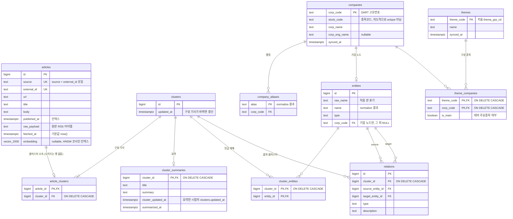

# 투자 에이전트

척척개미단의 투자 에이전트를 구현한 모노레포입니다. 뉴스를 수집하고 임베딩하며, 이벤트 단위로 묶고, 요약 생성과 지식 그래프를 추출하며, 이를 바탕으로 포트폴리오를 생성합니다.
- `news-preprocessor`: 뉴스 수집과 임베딩
- `news-clusterer`: 뉴스 이벤트 단위 클러스터링
- `news-graph-builder`: 뉴스 클러스터에서 지식 그래프 추출
- `portfolio-builder`: 뉴스 데이터를 바탕으로 포트폴리오 생성

## 데이터베이스 (ERD)

모든 서비스는 PostgreSQL `news` 데이터베이스를 통해서만 데이터를 주고받습니다. 데이터베이스 스키마는 `infrastructure/postgres/migrations/` 에서 관리합니다.

| 테이블 | 쓰는 서비스 | 마이그레이션 |
|---|---|---|
| `articles` | news-preprocessor | `0001` |
| `clusters`, `article_clusters` | news-clusterer | `0002` |
| `cluster_summaries`, `companies`, `company_aliases`, `entities`, `cluster_entities`, `relations` | news-graph-builder | `0003` |
| `themes`, `theme_companies` | news-graph-builder | `0004` |

- `entities` 의 유일성: 기업 노드는 `corp_code` 로, 그 외 개체는 `(name, type)` 으로 유일합니다 (둘 다 부분 유니크 인덱스).
- `clusters` 를 참조하는 FK 는 모두 `ON DELETE CASCADE` 라서, news-clusterer 가 클러스터를 지우면 요약과 그래프 행도 함께 지워집니다.
- `themes` / `theme_companies` 는 매 실행마다 통째로 교체되는 참조 데이터이며, 구성 종목은 KOSPI 200 이면서 `companies` 에 있는 종목만 저장합니다.

## 환경 변수

서비스별 설정은 각 서비스의 접두사가 붙은 환경 변수로 읽습니다.

### 공통 · 도구

| 변수 | 필수 | 기본값 | 설명 |
|---|---|---|---|
| `KTB_POSTGRES_DSN` | 마이그레이션 시 | | `alembic upgrade`가 사용하는 DSN |
| `KTB_TEST_POSTGRES_DSN` | | | DB 테스트용 DSN. 없으면 해당 테스트를 건너뜀. 테스트가 테이블을 비우므로 `news`가 아닌 `news_test`를 가리킬 것 |
| `KTB_EMBEDDING_BASE_URI` | news-preprocessor | | OpenAI 호환 임베딩 서버 주소 (`/v1` 포함) |
| `KTB_EMBEDDING_MODEL` | | `mlx-community/Qwen3-Embedding-4B-4bit-DWQ` | 임베딩 모델 |
| `KTB_EMBEDDING_DIMENSIONS` | | `2000` | DB 컬럼 `vector(2000)`과 같아야 함 |
| `KTB_EMBEDDING_MAX_TOKENS` | | `16384` | 임베딩 입력 최대 토큰 |

### news-preprocessor (`NEWS_PREPROCESSOR_`)

| 변수 | 필수 | 기본값 |
|---|---|---|
| `NEWS_PREPROCESSOR_POSTGRES_DSN` | 필수 | |
| `NEWS_PREPROCESSOR_EMBED_BATCH_LIMIT` | | `100` |
| `NEWS_PREPROCESSOR_USER_AGENT` | | `ktb-ai/0.1` |
| `NEWS_PREPROCESSOR_LOG_LEVEL` | | `INFO` |

### news-clusterer (`NEWS_CLUSTERER_`)

| 변수 | 필수 | 기본값 |
|---|---|---|
| `NEWS_CLUSTERER_POSTGRES_DSN` | 필수 | |
| `NEWS_CLUSTERER_EPS` | | `0.2` (코사인 거리, 0 초과 2 이하) |
| `NEWS_CLUSTERER_MIN_SAMPLES` | | `3` |
| `NEWS_CLUSTERER_LOG_LEVEL` | | `INFO` |

### news-graph-builder (`NEWS_GRAPH_BUILDER_`)

| 변수 | 필수 | 기본값 | 설명 |
|---|---|---|---|
| `NEWS_GRAPH_BUILDER_POSTGRES_DSN` | 필수 | | |
| `NEWS_GRAPH_BUILDER_LOG_LEVEL` | | `INFO` | |
| `NEWS_GRAPH_BUILDER_LLM_BASE_URI` | 필수 | | OpenAI 호환 LLM 서버 주소 (`/v1` 포함) |
| `NEWS_GRAPH_BUILDER_LLM_MODEL` | 필수 | | |
| `NEWS_GRAPH_BUILDER_SUMMARY_MAX_CHARS` | | `24000` | LLM에 넣는 기사 본문 글자 수 상한 |
| `NEWS_GRAPH_BUILDER_LLM_TIMEOUT` | | `120` | 초 |
| `NEWS_GRAPH_BUILDER_MAX_ENTITIES` | | `30` | 클러스터당 개체 수 상한 |
| `NEWS_GRAPH_BUILDER_MAX_RELATIONS` | | `50` | 클러스터당 관계 수 상한 |
| `NEWS_GRAPH_BUILDER_KIWOOM_APP_KEY` | 필수 | | 키움 REST API 앱 키 |
| `NEWS_GRAPH_BUILDER_KIWOOM_SECRET_KEY` | 필수 | | 키움 REST API 시크릿 키 |
| `NEWS_GRAPH_BUILDER_KIWOOM_BASE_URI` | | `https://api.kiwoom.com` | 모의투자 도메인으로 바꿀 수 있음 |
| `NEWS_GRAPH_BUILDER_KIWOOM_REQUEST_INTERVAL` | | `0.2` | 키움 요청 사이 대기 시간(초) |
| `NEWS_GRAPH_BUILDER_DART_API_KEY` | 필수 | | OpenDART API 키. `compose.dev.yaml`은 `.env`의 `OPENDART_API_KEY`에서 채움 |

키움 키는 주문이 가능한 키이므로 모의투자 키나 전용 계정을 권장하고, 운영 태스크의 outbound IP를 키움에 등록해야 합니다. 키는 커밋하지 말고, 명령줄에 직접 입력하는 대신 파일에서 export 하세요.

### portfolio-builder (`PORTFOLIO_BUILDER_`)

| 변수 | 필수 | 기본값 |
|---|---|---|
| `PORTFOLIO_BUILDER_POSTGRES_DSN` | 필수 | |
| `PORTFOLIO_BUILDER_QUESTDB_DSN` | 필수 | |
| `PORTFOLIO_BUILDER_NEWS_CLUSTERER_URL` | 필수 | |
| `PORTFOLIO_BUILDER_LOG_LEVEL` | | `INFO` |
