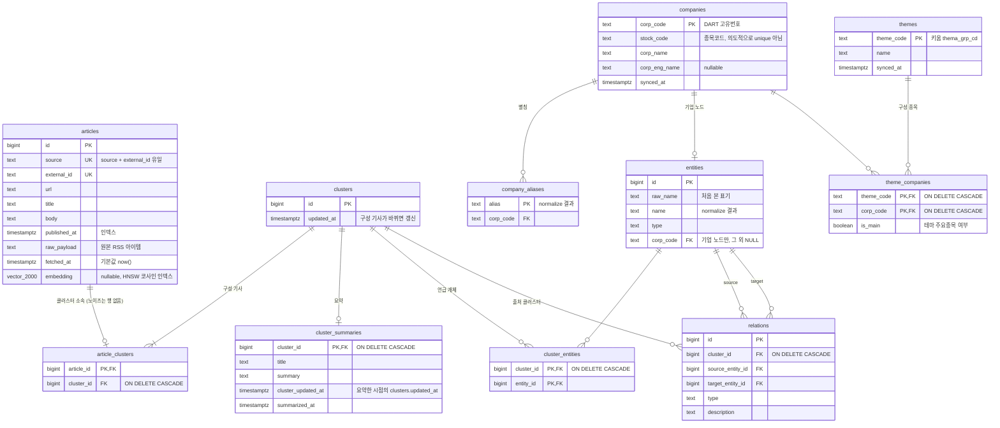

# 투자 에이전트

척척개미단의 투자 에이전트를 구현한 모노레포입니다. 뉴스를 수집하고 임베딩하며, 이벤트 단위로 묶고, 요약 생성과 지식 그래프를 추출하며, 이를 바탕으로 포트폴리오를 생성합니다.
- `news-preprocessor`: 뉴스 수집과 임베딩
- `news-clusterer`: 뉴스 이벤트 단위 클러스터링
- `news-graph-builder`: 뉴스 클러스터에서 지식 그래프 추출
- `portfolio-builder`: 뉴스·지식 그래프·기술적 근거로 모델 포트폴리오 생성 (LangChain 에이전트)
- `market-collector`: 외부 스케줄러가 실행하는 키움 OHLCV 보관 작업
- `market-analyzer-mcp`: 시장 분석 도구를 제공하는 MCP 서버 (Docker 네트워크 내부 전용)
- `portfolio-rebalancer-http`: 모델 포트폴리오를 매수·매도 요청으로 바꾸는 HTTP 서버
- `portainer`: 컨테이너 상태와 CPU, 메모리, 네트워크, 디스크 I/O를 조회하고 노드 알림을 보내는 관리 UI

## 컨테이너 메트릭

Portainer는 기본 Compose 실행에 포함됩니다.

```bash
docker compose -f compose.dev.yaml up -d
```

시작 후 `https://localhost:9443`에 접속해 관리자 계정을 만들고 Portainer Business Edition
라이선스를 등록합니다. 로컬 환경의 `Containers`에서 컨테이너를 선택하고 `Stats`를 열면
실시간 메트릭을 볼 수 있습니다. 자체 서명 인증서를 사용하므로 처음 접속할 때 브라우저
경고가 표시될 수 있습니다.

알림은 관리자 계정으로 다음 순서로 설정합니다.

1. `Settings` → `General` → `Additional functionality`에서 `Observability`를 활성화합니다.
2. `Alerting` → `Settings`에서 `internal` Alertmanager를 활성화합니다.
3. Slack, 이메일, Microsoft Teams 또는 Webhook 채널을 추가하고 `Test`로 전송을 확인합니다.
4. `Alerting` → `Rules`에서 `Environment High CPU Usage %`,
   `Environment High Memory Usage %`, `Environment Down` 규칙을 활성화합니다.

CPU와 메모리 규칙은 개별 컨테이너가 아니라 Docker 환경인 단일 노드 전체 사용량을
감시합니다. Portainer와 감시 대상이 같은 노드에 있으므로 노드 자체가 중단되면 Portainer도
알림을 전송할 수 없습니다. EC2 상태 검사 실패 알림은 CloudWatch에 별도로 유지해야 합니다.

포트가 겹치면 `PORTAINER_HTTPS_PORT`로 호스트 포트를 바꿀 수 있습니다.

```bash
PORTAINER_HTTPS_PORT=10443 docker compose -f compose.dev.yaml up -d portainer
```

Portainer는 호스트의 Docker 소켓에 접근하므로 호스트의 컨테이너를 제어할 수 있습니다.
운영 환경에서는 9443 포트를 신뢰할 수 있는 네트워크에만 허용하고 강한 관리자 비밀번호를
설정해야 합니다. Portainer 설정과 계정은 `portainer-data` 볼륨에 유지됩니다.

## 데이터베이스 (ERD)

데이터베이스 스키마는 `infrastructure/postgres/migrations/` 에 작성합니다.

QuestDB는 서비스 시작 전에 별도 작업으로 초기화합니다.

```bash
KTB_QUESTDB_CONF='ws::addr=localhost:9000;' uv run python infrastructure/questdb/migrate.py
```


```mermaid
erDiagram
    articles ||--o| article_clusters : "클러스터 소속 (노이즈는 행 없음)"
    clusters ||--|{ article_clusters : "구성 기사"
    clusters ||--o| cluster_summaries : "요약"
    clusters ||--o{ cluster_entities : "언급 개체"
    clusters ||--o{ relations : "출처 클러스터"
    entities ||--o{ cluster_entities : ""
    entities ||--o{ relations : "source"
    entities ||--o{ relations : "target"
    companies ||--o{ company_aliases : "별칭"
    companies ||--o| entities : "기업 노드"
    companies ||--o{ theme_companies : ""
    themes ||--o{ theme_companies : "구성 종목"

    articles {
        bigint id PK
        text source UK "source + external_id 유일"
        text external_id UK
        text url
        text title
        text body
        timestamptz published_at "인덱스"
        text raw_payload "원본 RSS 아이템"
        timestamptz fetched_at "기본값 now()"
        vector_2000 embedding "nullable, HNSW 코사인 인덱스"
    }
    clusters {
        bigint id PK
        timestamptz updated_at "구성 기사가 바뀌면 갱신"
    }
    article_clusters {
        bigint article_id PK, FK
        bigint cluster_id FK "ON DELETE CASCADE"
    }
    cluster_summaries {
        bigint cluster_id PK, FK "ON DELETE CASCADE"
        text title
        text summary
        timestamptz cluster_updated_at "요약한 시점의 clusters.updated_at"
        timestamptz summarized_at
    }
    companies {
        text corp_code PK "DART 고유번호"
        text stock_code "종목코드, 의도적으로 unique 아님"
        text corp_name
        text corp_eng_name "nullable"
        timestamptz synced_at
    }
    company_aliases {
        text alias PK "normalize 결과"
        text corp_code FK
    }
    entities {
        bigint id PK
        text raw_name "처음 본 표기"
        text name "normalize 결과"
        text type
        text corp_code FK "기업 노드만, 그 외 NULL"
    }
    cluster_entities {
        bigint cluster_id PK, FK "ON DELETE CASCADE"
        bigint entity_id PK, FK
    }
    relations {
        bigint id PK
        bigint cluster_id FK "ON DELETE CASCADE"
        bigint source_entity_id FK
        bigint target_entity_id FK
        text type
        text description
    }
    themes {
        text theme_code PK "키움 thema_grp_cd"
        text name
        timestamptz synced_at
    }
    theme_companies {
        text theme_code PK, FK "ON DELETE CASCADE"
        text corp_code PK, FK "ON DELETE CASCADE"
        boolean is_main "테마 주요종목 여부"
    }
```

| 테이블 | 관리 주체 서비스 | 마이그레이션 |
|---|---|---|
| `articles` | `news-preprocessor` | `0001` |
| `clusters`, `article_clusters` | `news-clusterer` | `0002` |
| `cluster_summaries`, `companies`, `company_aliases`, `entities`, `cluster_entities`, `relations` | `news-graph-builder` | `0003` |
| `themes`, `theme_companies` | news-graph-builder | `0004` |

- `themes` / `theme_companies` 는 KOSPI 200 이면서 `companies` 에 있는 종목만 저장합니다.

## 환경 변수

서비스별 설정은 각 서비스의 접두사가 붙은 환경 변수로 읽습니다.

Compose의 데이터베이스 연결 정보도 환경 변수로만 받습니다. 로컬에서는 Git에서 제외된
`.env`에 다음 여섯 값을 설정합니다. 비밀번호는 DSN에 그대로 들어가므로 영문 대소문자,
숫자, `_`, `-`만 사용한 32자 이상의 값을 사용합니다.

| 변수 | 필수 | 설명 |
|---|---|---|
| `POSTGRES_USER` | 필수 | PostgreSQL 사용자 |
| `POSTGRES_DB` | 필수 | PostgreSQL 데이터베이스 |
| `POSTGRES_PASSWORD` | 필수 | PostgreSQL 비밀번호 |
| `QUESTDB_USER` | 필수 | QuestDB PGWire 사용자 |
| `QUESTDB_DATABASE` | 필수 | QuestDB PGWire DSN의 데이터베이스 이름 |
| `QUESTDB_PASSWORD` | 필수 | QuestDB PGWire 비밀번호 |

운영 배포는 EC2의 `~/ai/.env`에서 이 여섯 값을 읽습니다. CD는 이 파일을 수정하거나
GitHub Secrets의 DB 값을 전달하지 않습니다. PostgreSQL 볼륨이 이미 생성된 환경에서는
`.env`만 바꾸지 말고 실제 DB 역할의 비밀번호도 같은 값으로 변경해야 합니다.

### 공통 · 도구

| 변수 | 필수 | 기본값 | 설명 |
|---|---|---|---|
| `KTB_POSTGRES_DSN` | 마이그레이션 시 | | `alembic upgrade`가 사용하는 DSN |
| `KTB_TEST_POSTGRES_DSN` | | | DB 테스트용 DSN. 없으면 해당 테스트를 건너뜀. 테스트가 테이블을 비우므로 `ktb`가 아닌 `ktb_test`를 가리킬 것 |
| `KTB_EMBEDDING_BASE_URI` | news-preprocessor | | OpenAI 호환 임베딩 서버 주소 (`/v1` 포함) |
| `KTB_EMBEDDING_MODEL` | | `mlx-community/Qwen3-Embedding-4B-4bit-DWQ` | 임베딩 모델 |
| `KTB_EMBEDDING_DIMENSIONS` | | `2000` | DB 컬럼 `vector(2000)`과 같아야 함 |
| `KTB_EMBEDDING_MAX_TOKENS` | | `16384` | 임베딩 입력 최대 토큰 |

### news-preprocessor (`NEWS_PREPROCESSOR_`)

| 변수 | 필수 | 기본값 |
|---|---|---|
| `NEWS_PREPROCESSOR_POSTGRES_DSN` | 필수 | |
| `NEWS_PREPROCESSOR_EMBED_BATCH_LIMIT` | | `100` |
| `NEWS_PREPROCESSOR_USER_AGENT` | | `ktb-ai/0.1` |
| `NEWS_PREPROCESSOR_LOG_LEVEL` | | `INFO` |

### news-clusterer (`NEWS_CLUSTERER_`)

| 변수 | 필수 | 기본값 |
|---|---|---|
| `NEWS_CLUSTERER_POSTGRES_DSN` | 필수 | |
| `NEWS_CLUSTERER_EPS` | | `0.2` (코사인 거리, 0 초과 2 이하) |
| `NEWS_CLUSTERER_MIN_SAMPLES` | | `3` |
| `NEWS_CLUSTERER_LOG_LEVEL` | | `INFO` |

### news-graph-builder (`NEWS_GRAPH_BUILDER_`)

| 변수 | 필수 | 기본값 | 설명 |
|---|---|---|---|
| `NEWS_GRAPH_BUILDER_POSTGRES_DSN` | 필수 | | |
| `NEWS_GRAPH_BUILDER_LOG_LEVEL` | | `INFO` | |
| `NEWS_GRAPH_BUILDER_LLM_BASE_URI` | 필수 | | OpenAI 호환 LLM 서버 주소 (`/v1` 포함) |
| `NEWS_GRAPH_BUILDER_LLM_MODEL` | 필수 | | |
| `NEWS_GRAPH_BUILDER_LLM_API_KEY` | | | OpenAI 호환 API 키. 설정하면 `Authorization: Bearer` 로 보냄 (키가 필요 없는 로컬 vLLM 은 비워 둠) |
| `NEWS_GRAPH_BUILDER_SUMMARY_MAX_CHARS` | | `24000` | LLM에 넣는 기사 본문 글자 수 상한 |
| `NEWS_GRAPH_BUILDER_LLM_TIMEOUT` | | `120` | 초 |
| `NEWS_GRAPH_BUILDER_MAX_ENTITIES` | | `30` | 클러스터당 개체 수 상한 |
| `NEWS_GRAPH_BUILDER_MAX_RELATIONS` | | `50` | 클러스터당 관계 수 상한 |
| `NEWS_GRAPH_BUILDER_KIWOOM_APP_KEY` | 필수 | | 키움 REST API 앱 키 |
| `NEWS_GRAPH_BUILDER_KIWOOM_SECRET_KEY` | 필수 | | 키움 REST API 시크릿 키 |
| `NEWS_GRAPH_BUILDER_KIWOOM_BASE_URI` | | `https://api.kiwoom.com` | 모의투자 도메인으로 바꿀 수 있음 |
| `NEWS_GRAPH_BUILDER_KIWOOM_REQUEST_INTERVAL` | | `0.2` | 키움 요청 사이 대기 시간(초) |
| `NEWS_GRAPH_BUILDER_DART_API_KEY` | 필수 | | OpenDART API 키. `compose.dev.yaml`은 `.env`의 `OPENDART_API_KEY`에서 채움 |

### market-collector (`MARKET_COLLECTOR_`)

| 변수 | 필수 | 기본값 | 설명 |
|---|---|---|---|
| `MARKET_COLLECTOR_QUESTDB_CONF` | 필수 | | QuestDB 공식 Python 클라이언트 연결 문자열 |
| `MARKET_COLLECTOR_KIWOOM_ACCOUNTS` | 필수 | | `app_key`, `secret_key` 객체의 JSON 배열 |
| `MARKET_COLLECTOR_KIWOOM_MODE` | | `real` | `real` 또는 `demo` |
| `MARKET_COLLECTOR_INDEX_CODE` | | `201` | 수집 종목을 구성하는 지수 코드 |
| `MARKET_COLLECTOR_REQUEST_INTERVAL` | | `1.3` | 키움 REST 요청 사이 대기 시간(초) |

### portfolio-builder (`PORTFOLIO_BUILDER_`)

| 변수 | 필수 | 기본값 |
|---|---|---|
| `PORTFOLIO_BUILDER_POSTGRES_DSN` | 필수 | |
| `PORTFOLIO_BUILDER_QUESTDB_CONF` | 필수 | 예: `ws::addr=localhost:9000;` |
| `PORTFOLIO_BUILDER_OPENROUTER_API_KEY` | 필수 | |
| `PORTFOLIO_BUILDER_LLM_MODEL` | 필수 | OpenRouter 모델 ID |
| `PORTFOLIO_BUILDER_THINKING_LEVEL` | | `medium` |
| `PORTFOLIO_BUILDER_NEWS_WINDOW_DAYS` | | `7` |
| `PORTFOLIO_BUILDER_MAX_TURNS` | | `150` |
| `PORTFOLIO_BUILDER_LOG_LEVEL` | | `INFO` |

### market-analyzer-mcp (`MARKET_ANALYZER_MCP_`)

| 변수 | 필수 | 기본값 |
|---|---|---|
| `MARKET_ANALYZER_MCP_LOG_LEVEL` | | `INFO` |
| `MARKET_ANALYZER_MCP_HOST` | | `0.0.0.0` |
| `MARKET_ANALYZER_MCP_PORT` | | `8000` |

### portfolio-rebalancer-http (`PORTFOLIO_REBALANCER_HTTP_`)

| 변수 | 필수 | 기본값 |
|---|---|---|
| `PORTFOLIO_REBALANCER_HTTP_LOG_LEVEL` | | `INFO` |
| `PORTFOLIO_REBALANCER_HTTP_HOST` | | `0.0.0.0` |
| `PORTFOLIO_REBALANCER_HTTP_PORT` | | `8000` |
