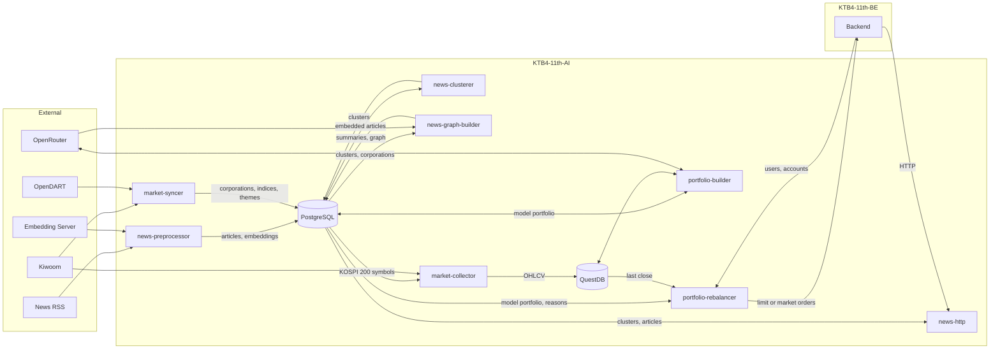
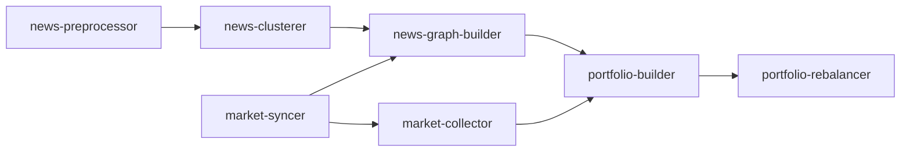

# 투자 에이전트

척척개미단의 주식 투자 에이전트

## 전체 아키텍처


```mermaid
flowchart LR
    subgraph EXT["External"]
        NEWS["News RSS"]
        KIWOOM["Kiwoom"]
        DART["OpenDART"]
        EMB["Embedding Server"]
        OPENROUTER["OpenRouter"]
    end

    subgraph AI["KTB4-11th-AI"]
        NP["news-preprocessor"]
        NC["news-clusterer"]
        MS["market-syncer"]
        NGB["news-graph-builder"]
        NH["news-http"]
        MC["market-collector"]
        PB["portfolio-builder"]
        PR["portfolio-rebalancer"]
        PG[("PostgreSQL")]
        QDB[("QuestDB")]
    end

    subgraph BACKEND["KTB4-11th-BE"]
        BE["Backend"]
    end

    NEWS --> NP
    EMB --> NP
    NP -->|articles, embeddings| PG
    PG -->|embedded articles| NC
    NC -->|clusters| PG

    KIWOOM --> MS
    DART --> MS
    MS -->|corporations, indices, themes| PG
    PG -->|clusters, corporations| NGB
    OPENROUTER --> NGB
    NGB -->|summaries, graph| PG
    PG -->|clusters, articles| NH
    BE -->|HTTP| NH

    PG -->|KOSPI 200 symbols| MC
    KIWOOM --> MC
    MC -->|OHLCV| QDB

    PG <-->|model portfolio| PB
    QDB <--> PB
    OPENROUTER <--> PB

    PG -->|model portfolio, reasons| PR
    QDB -->|last close| PR
    BE -->|users, accounts| PR
    PR -->|limit or market orders| BE
```

## 서비스 실행 의존 관계

화살표는 앞 서비스의 데이터가 준비된 후 뒤 서비스를 실행한다는 뜻입니다. PostgreSQL과 QuestDB 마이그레이션은 해당 서비스를 실행하기 전에 적용합니다.


```mermaid
flowchart LR
    NP["news-preprocessor"] --> NC["news-clusterer"] --> NGB["news-graph-builder"] --> PB["portfolio-builder"] --> PR["portfolio-rebalancer"]
    MS["market-syncer"] --> NGB
    MS --> MC["market-collector"] --> PB
```

## 서비스별 역할

### `news-preprocessor`: 뉴스 가져와서 저장하기

- 경제 뉴스 RSS를 읽고 각 사이트의 본문 구조에 맞게 기사 추출
- 기사 제목과 본문을 PostgreSQL `articles`에 저장 후 임베딩 시도
- 임베딩은 OpenAI API와 호완되는 서버로 요청을 보내며 2000차원으로 임베딩

### `news-clusterer`: 저장된 뉴스 클러스터링하기

- PostgreSQL에서 임베딩이 있는 기사를 모두 가져와 코사인 거리 기반 DBSCAN을 계산
  - 이 때 두 개의 환경변수를 사용하며, `NEWS_CLUSTERER_EPS`는 이웃으로 볼 최대 거리를, `NEWS_CLUSTERER_MIN_SAMPLES`는 핵심점에 필요한 최소 기사 수를 정함
- `clusters`, `article_clusters`에 기사의 클러스터 정보를 저장하고 클러스터에 속하지 않는 기사는 노이즈로 처리함
- 실행마다 기사 수, 군집 수, 소요 시간, 최대 메모리를 기록해, 전체 재계산을 증분 방식으로 바꿀 시점을 판단함

### `market-syncer`: KOSPI 200 종목과 테마 정보 업데이트하기

- 키움의 KOSPI 종목코드와 OpenDART의 기업 고유번호를 연결해 `corporations`, `corporation_aliases`를 업데이트함
- 키움에서 KOSPI 200 구성 종목과 테마별 종목을 받아 `corporation_indices`, `themes`, `theme_companies`를 업데이트함

### `news-graph-builder`: 클러스터링 된 뉴스에서 지식 정보 추출하기

- 클러스터링 된 전체 기사의 제목과 본문 전체를 LLM 서버에 보내 제목과 요약, 지식 데이터를 한 번에 추출함

### `news-http`: 백엔드에 뉴스 데이터 제공하기

- 백엔드가 사설망에서 호출하는 읽기 전용 HTTP API이며 인증은 없음
- `GET /stocks/{stock_code}/clusters`는 종목을 언급한 뉴스 클러스터를 최신 기사 순으로 반환함
- `GET /clusters/{cluster_id}/articles`는 클러스터에 속한 기사를 최신 순으로 반환하며, 본문은 포함하지 않음
- `GET /clusters/search`, `GET /clusters/{cluster_id}`, `GET /news/recent`, `GET /graph/neighborhood`, `GET /graph/paths`로 검색, 요약 뉴스, 지식 그래프를 조회할 수 있음
- 두 목록 모두 `limit`와 `cursor`로 무한 스크롤을 지원하며 응답의 `next_cursor`가 `null`이면 마지막 페이지임
- 클러스터링이 다시 실행되면 클러스터가 사라질 수 있어 이전에 받은 클러스터 id에도 404가 올 수 있음
- 포트폴리오 빌더도 이 API를 통해 뉴스와 그래프 데이터를 조회함

### `market-collector`: 시장에서 OHLCV 데이터 수집하기

- PostgreSQL의 `corporation_indices`에서 현재 KOSPI 200 종목을 읽어오고, 종목과 시간 단위별 마지막 저장 시점을 확인한 후 키움에서 빠진 데이터를 가져와 QuestDB에 저장함
- QuestDB의 `bars_15m`, `bars_1h`는 `bars_1m` 을 통해 생성함

### `portfolio-builder`: 수집하고 추출한 정보를 바탕으로 투자 포트폴리오 생성하기

- PostgreSQL의 이전 포트폴리오와 news-http의 최근 뉴스, 관련 기업과 테마를 묶어 에이전트의 시작 자료를 생성함
- 에이전트는 세 개의 도구(뉴스 검색, 그래프 탐색, QuestDB OHLCV에 대한 기술적 분석)를 호출해 투자 포트폴리오를 생성함
- 생성된 포트폴리오를 이전 포트폴리오와 비교해 편입 대상과 편출 대상을 선정하고, `portfolios`, `portfolio_holdings`, `portfolio_exits`에 한 버전으로 저장함
- 기술적 신호는 TA-Lib와 고정 규칙으로 계산함
- 실행 기록을 `trace`에 보관하고 별도 LLM 호출로 종목별 매수와 매도 설명을 만들어 `portfolio_reasons`에 저장함
- 설명까지 생성된 포트폴리오는 `ready` 상태로 전환

### `portfolio-rebalancer`: 생성된 투자 포트폴리오를 기반으로 유저의 투자 포트폴리오 업데이트하기

- 가장 최근 포트폴리오가 `ready` 일 때 거래 시작
- 백엔드에서 유저의 계좌, 현금, 보유 종목, 미체결 주문을 가져옴
- 미체결 주문을 모두 취소한 뒤 계좌 상태를 다시 읽고 목표 비중과 비교해 필요한 매수와 매도를 계산
- 기존 보유 종목의 보유량이 목표와의 차이가 `PORTFOLIO_REBALANCER_BAND`를 넘을 때 거래
- QuestDB의 최근 1분봉 가격과 20개 일봉으로 주간 가격 경계를 계산
- 경계는 위, 아래로 두 개 생성하며, 매도일 때는 높은 가격에 시도 후 낮은 가격에 도달하면 시장가 매도, 매수일 때는 낮은 가격에 시도 후 높은 가격에 도달하면 시장가 매수를 진행함
- 주문마다 `portfolio_reasons`을 백엔드에 보냄

## 개발 환경에서 실행

저장소 루트에서 `.env.example`을 `.env`로 복사해 해당 작업의 필수 값을 환경에 설정합니다.

### 스키마 적용하기

```bash
docker compose -f compose.dev.yaml up -d postgres questdb redis
uv run alembic upgrade head
KTB_QUESTDB_CONF='ws::addr=localhost:9000;' uv run python infrastructure/questdb/migrate.py
```

### 각 서비스 실행하기

```bash
docker compose -f compose.dev.yaml up -d news-http
docker compose -f compose.dev.yaml run --rm news-preprocessor
docker compose -f compose.dev.yaml run --rm news-clusterer
docker compose -f compose.dev.yaml run --rm market-syncer
docker compose -f compose.dev.yaml run --rm news-graph-builder
docker compose -f compose.dev.yaml run --rm market-collector
docker compose -f compose.dev.yaml run --rm portfolio-builder
docker compose -f compose.dev.yaml run --rm portfolio-rebalancer
```

## 데이터베이스 (ERD): [mermaid.live](https://mermaid.live/edit#pako:eNrNWO9P20YY_ldO_tRqAZGkUMg3BFSbQG1VWk2akKyLfSRubV90Pq-EUIlVpKItnboNWraGDW3VqlZMCj_GMqn9h-LL_7A7_4pjx4ZoH7Z88_l97n2f9973uddpSApWkVSSEJnXYIVAY8UE_AcJ1RQdWWBjY2wMbwTPsqLbFkXEAiWwIvW-OXN-OWLP3va22oA92WFPXoArTrPDDs7Y79vOs13Qe_UUsNdP2MHO1RXJ2zncQey80Ri-c_fPI7Z1DLqdNnt8NBTJY_KfZcs2DEg05EHZT7ts79NwTCPEIJNqNIS86nQ7T0G33WInZ2lIgnRINWz6kHNuuw-iGQiA4dZZLtOMB71Y2CYKupwthaSCaBg9JjVM_NdBIP01GeoatPxYnNMt9vcfl0VqpqopQeLebbJtnoVvO-znZvoGG2CAuzjV103AC8X5oZXlllaRwQsDGzVoxhPnvsu09GuI_dp0PrwPYNwHXcW6hkNouCJXsa5qZsWvbZfTCGi0ptE-9Lw1ApQgaIWF5aL4kQC29db50MzKT0rowlQWbX05bD_wEYHRsAegMQlpeM_iV9YqmkmBpoLbi_1VitYo8God3FsM6x58BvgLREyoyxzBWofs4GMQWoiLmtyLb2oTPbbC61BHsbUyVuuRJY0XFoVGja6Dml3WNauKVBlScTgHHefFMW_3RBQEPpRrsK5jqAq7Ny-d0w64s7wM2N4Wl8NeszUAibhYRVQJHfDW4MBu-3tg4odXrkYxXyOFYiIXJiYmADLKSBUHziGmreuwrKMc-Pzm8peAfdrlkskDBYlgH8WE7eJziYRp11RIwzCj8txtbwKnvets7jjvz7iIHrPnhzGXCY1Pug5M3BBy4MZiwiLQUW5xQxTJrZtgfmFp4e4CmJtdnpudXxjOM3I9NLL29Lxm7ZtZQ56XlDIK3Awk0buoentcKZ632OFLdrAfns143zKtbnxa657RAPFo1zbicVKsPHA7lTMO9YZXTUSLQ-Owq722nJ-9cxd0Tw95Jzon2739TgJgQiOeGB7kAyT4Lt5avv1Fsn3NiixQkUpOZVw3lUy24a0WJ-2ue3xNTAz-uI5A96TdPU3qSSRBQREO8RTcgpnpHSxj9z3HoTWPsBuOmxTe07HaDe_Ly2mnUB8_iXwq4dMWEPLT-67FO3ToGV0mEbReQ1m5id_kzrudHOj-xYXnxw64eW9pKaUfM7iN3I4-zt2yHtcO329_TLowmaMqTQTjXVlyP5IhCuaNaCk2aTlXkaUQrSYYDNDyB6B4AQaTUNDfvcdv2ZtNdxnKFdHO6kVde2HLxaetzBguraqJ1rkw8xjrCJpAs2QD3sdEsG3uOO-2Afvto1BXV9r498eRc74ZK8bIODbSNajwoYdmjgMq5jMDAgq0qvJDpFWqNCGqhsFLYPCycJWSU4-MK_f5cFUGlEAl2YaQ2hYPAK3VdGh6ilRDppgIcrzeoVrPgei7VajpSE1LQX96TKaibzTaFekVR30AFb2XxhOzZiR3Q9PmTZsp14QXrQwJgXWgaOKE-k1spdD2Bt__mnOE3L_kE8zj_wtGlhYoUNmuA96cFtL1C3l7Ne-tior0mUo5qUI0VSpRYqOcZCB-dYlHyaXKv32F4KxI4kOEINVeG1P50DGmYB0T4VLgOY-vMDaCLQi2K1WptAp1iz9505b_B0howhsKkTlsm1Qq5SfcLaRSQ1qTSsWZifHidHE6ny_kpyYLk4WcVJdKk9PjhcLE1PS1wvXizMz1fOFRTlp3fRbHr_EXk8XJ6fxUfqYwVbj-6B_sZiCG) 에서 보기


```mermaid
erDiagram
    articles ||--o| article_clusters : "클러스터 소속 (노이즈는 행 없음)"
    clusters ||--|{ article_clusters : "구성 기사"
    clusters ||--o| cluster_summaries : "요약"
    clusters ||--o{ cluster_entities : "언급 개체"
    clusters ||--o{ relations : "출처 클러스터"
    entities ||--o{ cluster_entities : ""
    entities ||--o{ relations : "source"
    entities ||--o{ relations : "target"
    corporations ||--o{ corporation_aliases : "별칭"
    corporations ||--o{ corporation_indices : "지수 편입"
    corporations ||--o| entities : "기업 노드"
    corporations ||--o{ theme_companies : ""
    themes ||--o{ theme_companies : "구성 종목"
    portfolios ||--o{ portfolio_holdings : "편입 종목"
    portfolios ||--o{ portfolio_exits : "편출 종목"
    portfolios ||--o{ portfolio_reasons : "종목별 설명"
    corporations ||--o{ portfolio_holdings : "corp_code"
    corporations ||--o{ portfolio_exits : "corp_code"
    corporations ||--o{ portfolio_reasons : "corp_code"

    articles {
        bigint id PK
        text source UK "source + external_id 유일"
        text external_id UK
        text url
        text title
        text body
        timestamptz published_at "인덱스"
        text raw_payload "원본 RSS 아이템"
        timestamptz fetched_at "기본값 now()"
        vector_2000 embedding "nullable, HNSW 코사인 인덱스"
    }
    clusters {
        bigint id PK
        timestamptz updated_at "구성 기사가 바뀌면 갱신"
    }
    article_clusters {
        bigint article_id PK, FK
        bigint cluster_id FK "ON DELETE CASCADE"
    }
    cluster_summaries {
        bigint cluster_id PK, FK "ON DELETE CASCADE"
        text title
        text summary
        timestamptz cluster_updated_at "요약한 시점의 clusters.updated_at"
        timestamptz summarized_at
    }
    corporations {
        text stock_code PK "종목코드"
        text corp_code UK "DART 고유번호"
        text name
        text market "KOSPI"
        text eng_name "nullable"
        timestamptz synced_at
    }
    corporation_aliases {
        text alias PK "normalize 결과"
        text stock_code FK
    }
    corporation_indices {
        text stock_code PK, FK
        text index_name PK "KOSPI200"
    }
    entities {
        bigint id PK
        text raw_name "처음 본 표기"
        text name "normalize 결과"
        text type
        text stock_code FK "기업 노드만, 그 외 NULL"
    }
    cluster_entities {
        bigint cluster_id PK, FK "ON DELETE CASCADE"
        bigint entity_id PK, FK
    }
    relations {
        bigint id PK
        bigint cluster_id FK "ON DELETE CASCADE"
        bigint source_entity_id FK
        bigint target_entity_id FK
        text type
        text description
    }
    themes {
        text theme_code PK "키움 thema_grp_cd"
        text name
        timestamptz synced_at
    }
    theme_companies {
        text theme_code PK, FK "ON DELETE CASCADE"
        text stock_code PK, FK "ON DELETE CASCADE"
        boolean is_major "테마 주요종목 여부"
    }
    portfolios {
        bigint id PK
        timestamptz created_at "인덱스"
        double cash_weight
        text commentary
        text model
        jsonb trace
        text status "explanation_pending, ready, explanation_failed"
    }
    portfolio_holdings {
        bigint portfolio_id PK, FK "ON DELETE CASCADE"
        text company_id PK, FK "corporations.corp_code"
        double weight
        text reason "nullable"
        bigint_array cited_cluster_ids
    }
    portfolio_exits {
        bigint portfolio_id PK, FK "ON DELETE CASCADE"
        text company_id PK, FK "corporations.corp_code"
        text reason
        bigint_array cited_cluster_ids
    }
    portfolio_reasons {
        bigint portfolio_id PK, FK "ON DELETE CASCADE"
        text company_id PK, FK "corporations.corp_code"
        text side PK "buy or sell"
        text reason
        jsonb reasonings
    }
```

| 테이블 | 관리 주체 서비스 | 마이그레이션 |
|---|---|---|
| `articles` | `news-preprocessor` | `0001` |
| `clusters`, `article_clusters` | `news-clusterer` | `0002` |
| `cluster_summaries`, `entities`, `cluster_entities`, `relations` | `news-graph-builder` | `0003` |
| `corporations`, `corporation_aliases`, `corporation_indices`, `themes`, `theme_companies` | `market-syncer` | `0003`, `0004`, `0006` |
| `portfolios`, `portfolio_holdings`, `portfolio_exits` | `portfolio-builder` | `0005`, `0006` |
| `portfolio_reasons` | `portfolio-builder` | `0007` |
| `portfolios.status` | `portfolio-builder` | `0008` |

## 환경 변수

서비스별 설정은 각 서비스의 접두사가 붙은 환경 변수로 읽습니다.

Compose의 데이터베이스 연결 정보도 환경 변수로만 받습니다. 로컬에서는 Git에서 제외된 `.env.example`을 `.env`로 복사하고 다음 다섯 값을 설정합니다.

| 변수 | 필수 | 설명 |
|---|---|---|
| `POSTGRES_USER` | 필수 | PostgreSQL 사용자 |
| `POSTGRES_DB` | 필수 | PostgreSQL 데이터베이스 |
| `POSTGRES_PASSWORD` | 필수 | PostgreSQL 비밀번호 |
| `QUESTDB_USER` | 필수 | QuestDB PGWire 사용자 |
| `QUESTDB_PASSWORD` | 필수 | QuestDB PGWire 비밀번호 |

### 공통 / 도구

| 변수 | 필수 | 기본값 | 설명 |
|---|---|---|---|
| `KTB_POSTGRES_DSN` | 마이그레이션 시 | | `alembic upgrade`가 사용하는 DSN |
| `KTB_QUESTDB_CONF` | QuestDB 마이그레이션 시 | | 공식 클라이언트 연결 문자열 |
| `KTB_TEST_POSTGRES_DSN` | | | DB 테스트용 DSN. 없으면 해당 테스트를 건너뜀. 테스트가 테이블을 비우므로 `ktb`가 아닌 `ktb_test`를 가리킬 것 |
| `KTB_EMBEDDING_BASE_URI` | news-preprocessor | | OpenAI 호환 임베딩 서버 주소 (`/v1` 포함) |
| `KTB_EMBEDDING_API_KEY` | | | 설정하면 `Authorization: Bearer`로 전송 (예: OpenRouter `https://openrouter.ai/api/v1`). 키가 없는 로컬 서버면 비워 둠 |
| `KTB_EMBEDDING_MODEL` | | `mlx-community/Qwen3-Embedding-4B-4bit-DWQ` | 임베딩 모델 |
| `KTB_EMBEDDING_DIMENSIONS` | | `2000` | DB 컬럼 `vector(2000)`과 같아야 함 |
| `KTB_EMBEDDING_MAX_TOKENS` | | `16384` | 기사별 임베딩 입력 최대 토큰 수 |

### news-preprocessor (`NEWS_PREPROCESSOR_`)

| 변수 | 필수 | 기본값 | 조절 대상 |
|---|---|---|---|
| `NEWS_PREPROCESSOR_POSTGRES_DSN` | 필수 | | 기사 저장소 연결 |
| `NEWS_PREPROCESSOR_EMBED_BATCH_LIMIT` | | `100` | 한 번에 처리할 미임베딩 기사 수 |
| `NEWS_PREPROCESSOR_USER_AGENT` | | `ktb-ai/0.1` | 뉴스 요청의 User-Agent |
| `NEWS_PREPROCESSOR_LOG_LEVEL` | | `INFO` | 로그 수준 |

### news-clusterer (`NEWS_CLUSTERER_`)

| 변수 | 필수 | 기본값 | 조절 대상 |
|---|---|---|---|
| `NEWS_CLUSTERER_POSTGRES_DSN` | 필수 | | 기사와 클러스터 저장소 연결 |
| `NEWS_CLUSTERER_EPS` | | `0.36` | DBSCAN의 최대 코사인 거리 (0 초과 2 이하). Qwen3-Embedding-4B 기준이며 모델 변경 시 재조정 |
| `NEWS_CLUSTERER_MIN_SAMPLES` | | `2` | DBSCAN 핵심점에 필요한 최소 기사 수 |
| `NEWS_CLUSTERER_LOG_LEVEL` | | `INFO` | 로그 수준 |

### news-graph-builder (`NEWS_GRAPH_BUILDER_`)

| 변수 | 필수 | 기본값 | 설명 |
|---|---|---|---|
| `NEWS_GRAPH_BUILDER_POSTGRES_DSN` | 필수 | | 클러스터/기업 읽기와 그래프 저장 |
| `NEWS_GRAPH_BUILDER_LOG_LEVEL` | | `INFO` | 로그 수준 |
| `NEWS_GRAPH_BUILDER_LLM_BASE_URI` | 필수 | | OpenAI 호환 LLM 서버 주소 (`/v1` 포함) |
| `NEWS_GRAPH_BUILDER_LLM_MODEL` | 필수 | | 요약/그래프 추출에 사용할 모델 |
| `NEWS_GRAPH_BUILDER_LLM_API_KEY` | | | OpenAI 호환 API 키. 설정하면 `Authorization: Bearer` 로 보냄 (키가 필요 없는 로컬 vLLM 은 비워 둠) |
| `NEWS_GRAPH_BUILDER_SUMMARY_MAX_CHARS` | | `24000` | LLM에 넣는 기사 본문 글자 수 상한 |
| `NEWS_GRAPH_BUILDER_LLM_TIMEOUT` | | `120` | LLM 요청 제한 시간(초) |
| `NEWS_GRAPH_BUILDER_MAX_ENTITIES` | | `30` | 클러스터당 개체 수 상한 |
| `NEWS_GRAPH_BUILDER_MAX_RELATIONS` | | `50` | 클러스터당 관계 수 상한 |

### news-http (`NEWS_HTTP_`)

| 변수 | 필수 | 기본값 | 설명 |
|---|---|---|---|
| `NEWS_HTTP_POSTGRES_DSN` | 필수 | | 클러스터와 기사 읽기 |
| `NEWS_HTTP_HOST` | | `0.0.0.0` | 바인드 주소 |
| `NEWS_HTTP_PORT` | | `8000` | 바인드 포트 |
| `NEWS_HTTP_LOG_LEVEL` | | `INFO` | 로그 수준 |

### market-syncer (`MARKET_SYNCER_`)

| 변수 | 필수 | 기본값 | 설명 |
|---|---|---|---|
| `MARKET_SYNCER_POSTGRES_DSN` | 필수 | | 기업/지수/테마 저장소 연결 |
| `MARKET_SYNCER_KIWOOM_APP_KEY` | 필수 | | 키움 REST API 앱 키 |
| `MARKET_SYNCER_KIWOOM_SECRET_KEY` | 필수 | | 키움 REST API 시크릿 키 |
| `MARKET_SYNCER_KIWOOM_MODE` | | `real` | `real` 또는 `demo`(모의투자) |
| `MARKET_SYNCER_KIWOOM_REQUEST_INTERVAL` | | `0.2` | 키움 요청 사이 대기 시간(초) |
| `MARKET_SYNCER_DART_API_KEY` | 필수 | | OpenDART API 키. Compose도 같은 이름을 사용 |
| `MARKET_SYNCER_LOG_LEVEL` | | `INFO` | 로그 수준 |

### market-collector (`MARKET_COLLECTOR_`)

| 변수 | 필수 | 기본값 | 설명 |
|---|---|---|---|
| `MARKET_COLLECTOR_POSTGRES_DSN` | 필수 | | `corporation_indices` 를 읽는 DSN |
| `MARKET_COLLECTOR_QUESTDB_CONF` | 필수 | | QuestDB 공식 Python 클라이언트 연결 문자열 |
| `MARKET_COLLECTOR_KIWOOM_ACCOUNTS` | 필수 | | `app_key`, `secret_key` 객체의 JSON 배열 |
| `MARKET_COLLECTOR_KIWOOM_MODE` | | `real` | `real` 또는 `demo` |
| `MARKET_COLLECTOR_INDEX_NAME` | | `KOSPI200` | 수집 종목을 구성하는 지수 이름 |
| `MARKET_COLLECTOR_REQUEST_INTERVAL` | | `1.3` | 키움 REST 요청 사이 대기 시간(초) |
| `MARKET_COLLECTOR_LOG_LEVEL` | | `INFO` | 로그 수준 |

### portfolio-builder (`PORTFOLIO_BUILDER_`)

| 변수 | 필수 | 기본값 | 조절 대상 |
|---|---|---|---|
| `PORTFOLIO_BUILDER_POSTGRES_DSN` | 필수 | | 기업/포트폴리오 저장소 연결 |
| `PORTFOLIO_BUILDER_QUESTDB_CONF` | 필수 | | QuestDB 시세 연결 |
| `PORTFOLIO_BUILDER_NEWS_HTTP_BASE_URI` | 필수 | | news-http API 주소 |
| `PORTFOLIO_BUILDER_LLM_API_KEY` | 필수 | | OpenAI API 인증 |
| `PORTFOLIO_BUILDER_LLM_MODEL` | 필수 | | OpenAI API 모델 ID |
| `PORTFOLIO_BUILDER_THINKING_LEVEL` | | `medium` | 모델 추론 수준 (`none`/`minimal`/`low`/`medium`/`high`/`xhigh`) |
| `PORTFOLIO_BUILDER_NEWS_WINDOW_DAYS` | | `7` | 분석에 포함할 최근 뉴스 기간(일) |
| `PORTFOLIO_BUILDER_MAX_TURNS` | | `150` | 포트폴리오 에이전트의 최대 모델 호출 횟수 |
| `PORTFOLIO_BUILDER_EXPLAIN_RESULT_CHARS` | | `2000` | 설명 프롬프트에 포함할 도구 결과별 글자 수 상한 |
| `PORTFOLIO_BUILDER_EXPLAIN_MAX_TOKENS` | | `16000` | 설명 생성의 최대 출력 토큰 수 |
| `PORTFOLIO_BUILDER_LOG_LEVEL` | | `INFO` | 로그 수준 |


### portfolio-rebalancer (`PORTFOLIO_REBALANCER_`)

| 변수 | 필수 | 기본값 | 조절 대상 |
|---|---|---|---|
| `PORTFOLIO_REBALANCER_POSTGRES_DSN` | 필수 | | 최신 포트폴리오와 설명 읽기 |
| `PORTFOLIO_REBALANCER_QUESTDB_CONF` | 필수 | | 최근 종가 읽기 |
| `PORTFOLIO_REBALANCER_ORDER_QUEUE_URL` | 필수 | | 취소·주문을 발행하는 FIFO 큐 (`stockspoon-v2-dev-order.fifo`) |
| `PORTFOLIO_REBALANCER_ACCOUNT_QUEUE_URL` | 필수 | | Backend가 계좌 스냅샷을 발행하는 FIFO 큐 |
| `PORTFOLIO_REBALANCER_FAILURE_QUEUE_URL` | 필수 | | 스냅샷을 반려했을 때 실패를 알리는 큐 |
| `PORTFOLIO_REBALANCER_DRAIN_SECONDS` | | `30` | 계좌 큐를 비우는 데 쓰는 시간 상한 |
| `PORTFOLIO_REBALANCER_BAND` | | `0.05` | 기존 보유 종목이 목표 비중에서 벗어나야 거래하는 폭 |
| `PORTFOLIO_REBALANCER_BUY_BUFFER` | | `0.02` | 매수 수량 산정 시 종가에 더하는 비율 |
| `PORTFOLIO_REBALANCER_TEST_MODE` | | `false` | `true`면 KRX 거래일/시간 검사 생략 |
| `PORTFOLIO_REBALANCER_LOG_LEVEL` | | `INFO` | 로그 수준 |

### 설정 변경과 검증

환경 변수를 변경할 때는 서비스의 `settings.py`에서 필수 여부와 기본값을 확인하고 `.env.example`, 위 표, `compose.dev.yaml`, `compose.prod.yaml`을 함께 갱신합니다. 저장소 루트에서 다음 명령으로 확인합니다.

```bash
docker compose -f compose.dev.yaml --profile jobs config --quiet
docker compose -f compose.prod.yaml --profile jobs config --quiet
uv run pytest services/portfolio-rebalancer/tests/test_settings.py
```

운영용 Compose 검증에는 배포 환경의 `APP_IMAGE`와 필수 DB/Backend 환경 변수가 필요합니다. `config --quiet`는 컨테이너를 시작하지 않고 설정만 검사합니다.
