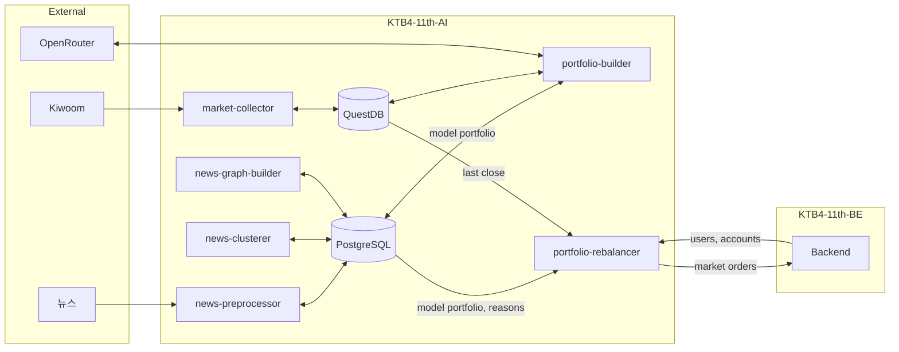

# 투자 에이전트

척척개미단의 투자 에이전트를 구현한 모노레포입니다. 뉴스를 수집하고 임베딩하며, 이벤트 단위로 묶고, 요약 생성과 지식 그래프를 추출하며, 이를 바탕으로 포트폴리오를 생성합니다.
- `news-preprocessor`: 뉴스 수집과 임베딩
- `news-clusterer`: 뉴스 이벤트 단위 클러스터링
- `market-syncer`: 키움과 OpenDART에서 종목과 테마 동기화
- `news-graph-builder`: 뉴스 클러스터에서 지식 그래프 추출
- `portfolio-builder`: 뉴스·지식 그래프·기술적 근거로 모델 포트폴리오 생성 (LangChain 에이전트)
- `market-collector`: 평일 09:55~14:55 KST와 15:35 KST에 실행되는 키움 OHLCV 보관 작업
- `portfolio-rebalancer`: 모델 포트폴리오를 계좌별 시장가 매수·매도 주문으로 바꿔 Backend 에 보냅니다


```mermaid
flowchart LR
    subgraph EXT["External"]
        NEWS["뉴스"]
        KIWOOM["Kiwoom"]
        OPENROUTER["OpenRouter"]
    end

    subgraph AI["KTB4-11th-AI"]
        NP["news-preprocessor"]
        NC["news-clusterer"]
        NGB["news-graph-builder"]
        MC["market-collector"]
        PB["portfolio-builder"]
        PR["portfolio-rebalancer"]

        PG[("PostgreSQL")]
        QDB[("QuestDB")]
    end

    subgraph BACKEND["KTB4-11th-BE"]
        BE["Backend"]
    end

    NEWS --> NP
    NP <--> PG
    NC <--> PG
    NGB <--> PG

    KIWOOM --> MC
    MC <--> QDB

    PG <-->|model portfolio| PB
    QDB <--> PB
    OPENROUTER <--> PB

    PG -->|model portfolio, reasons| PR
    QDB -->|last close| PR
    BE -->|users, accounts| PR
    PR -->|market orders| BE
```

## 데이터베이스 (ERD)

데이터베이스 스키마는 `infrastructure/postgres/migrations/` 에 작성합니다.

QuestDB는 서비스 시작 전에 별도 작업으로 초기화합니다.

```bash
KTB_QUESTDB_CONF='ws::addr=localhost:9000;' uv run python infrastructure/questdb/migrate.py
```


```mermaid
erDiagram
    articles ||--o| article_clusters : "클러스터 소속 (노이즈는 행 없음)"
    clusters ||--|{ article_clusters : "구성 기사"
    clusters ||--o| cluster_summaries : "요약"
    clusters ||--o{ cluster_entities : "언급 개체"
    clusters ||--o{ relations : "출처 클러스터"
    entities ||--o{ cluster_entities : ""
    entities ||--o{ relations : "source"
    entities ||--o{ relations : "target"
    corporations ||--o{ corporation_aliases : "별칭"
    corporations ||--o{ corporation_indices : "지수 편입"
    corporations ||--o| entities : "기업 노드"
    corporations ||--o{ theme_companies : ""
    themes ||--o{ theme_companies : "구성 종목"
    portfolios ||--o{ portfolio_holdings : "편입 종목"
    portfolios ||--o{ portfolio_exits : "편출 종목"
    portfolios ||--o{ portfolio_reasons : "종목별 설명"
    corporations ||--o{ portfolio_holdings : "corp_code"
    corporations ||--o{ portfolio_exits : "corp_code"
    corporations ||--o{ portfolio_reasons : "corp_code"

    articles {
        bigint id PK
        text source UK "source + external_id 유일"
        text external_id UK
        text url
        text title
        text body
        timestamptz published_at "인덱스"
        text raw_payload "원본 RSS 아이템"
        timestamptz fetched_at "기본값 now()"
        vector_2000 embedding "nullable, HNSW 코사인 인덱스"
    }
    clusters {
        bigint id PK
        timestamptz updated_at "구성 기사가 바뀌면 갱신"
    }
    article_clusters {
        bigint article_id PK, FK
        bigint cluster_id FK "ON DELETE CASCADE"
    }
    cluster_summaries {
        bigint cluster_id PK, FK "ON DELETE CASCADE"
        text title
        text summary
        timestamptz cluster_updated_at "요약한 시점의 clusters.updated_at"
        timestamptz summarized_at
    }
    corporations {
        text stock_code PK "종목코드"
        text corp_code UK "DART 고유번호"
        text name
        text market "KOSPI"
        text eng_name "nullable"
        timestamptz synced_at
    }
    corporation_aliases {
        text alias PK "normalize 결과"
        text stock_code FK
    }
    corporation_indices {
        text stock_code PK, FK
        text index_name PK "KOSPI200"
    }
    entities {
        bigint id PK
        text raw_name "처음 본 표기"
        text name "normalize 결과"
        text type
        text stock_code FK "기업 노드만, 그 외 NULL"
    }
    cluster_entities {
        bigint cluster_id PK, FK "ON DELETE CASCADE"
        bigint entity_id PK, FK
    }
    relations {
        bigint id PK
        bigint cluster_id FK "ON DELETE CASCADE"
        bigint source_entity_id FK
        bigint target_entity_id FK
        text type
        text description
    }
    themes {
        text theme_code PK "키움 thema_grp_cd"
        text name
        timestamptz synced_at
    }
    theme_companies {
        text theme_code PK, FK "ON DELETE CASCADE"
        text stock_code PK, FK "ON DELETE CASCADE"
        boolean is_major "테마 주요종목 여부"
    }
    portfolios {
        bigint id PK
        timestamptz created_at "인덱스"
        double cash_weight
        text commentary
        text model
        jsonb trace
        text status "explanation_pending, ready, explanation_failed"
    }
    portfolio_holdings {
        bigint portfolio_id PK, FK "ON DELETE CASCADE"
        text company_id PK, FK "corporations.corp_code"
        double weight
        text reason "nullable"
        bigint_array cited_cluster_ids
    }
    portfolio_exits {
        bigint portfolio_id PK, FK "ON DELETE CASCADE"
        text company_id PK, FK "corporations.corp_code"
        text reason
        bigint_array cited_cluster_ids
    }
    portfolio_reasons {
        bigint portfolio_id PK, FK "ON DELETE CASCADE"
        text company_id PK, FK "corporations.corp_code"
        text side PK "buy or sell"
        text reason
        jsonb reasonings
    }
```

| 테이블 | 관리 주체 서비스 | 마이그레이션 |
|---|---|---|
| `articles` | `news-preprocessor` | `0001` |
| `clusters`, `article_clusters` | `news-clusterer` | `0002` |
| `cluster_summaries`, `entities`, `cluster_entities`, `relations` | `news-graph-builder` | `0003` |
| `corporations`, `corporation_aliases`, `corporation_indices`, `themes`, `theme_companies` | `market-syncer` | `0003`, `0004`, `0006` |
| `portfolios`, `portfolio_holdings`, `portfolio_exits` | `portfolio-builder` | `0005`, `0006` |
| `portfolio_reasons` | `portfolio-builder` | `0007` |
| `portfolios.status` | `portfolio-builder` | `0008` |

- `corporations` 는 DART 고유번호와 연결되는 KOSPI 종목만, `corporation_indices` 는 KOSPI 200 구성 종목만 저장합니다.
- `themes` / `theme_companies` 는 `corporations` 에 있는 종목만 저장합니다.
- `portfolios.trace` 는 포트폴리오를 만든 에이전트 실행 기록, `portfolio_reasons` 는 종목별 매수·매도 설명입니다.
- `portfolios.status` 는 저장 직후 `explanation_pending`, 설명 저장 시 `ready`, 설명 실패 시 `explanation_failed` 입니다. `portfolio-rebalancer` 는 가장 최근 포트폴리오가 `ready` 일 때만 주문하고, 그 전 포트폴리오로 돌아가지 않습니다. `portfolio-builder` 는 가장 최근 포트폴리오가 `ready` 가 아니고 `trace` 가 있으면 새 포트폴리오를 만들지 않고 그 설명만 다시 만듭니다.
- `market-syncer` 는 `news-graph-builder`, `market-collector` 보다 먼저 실행합니다. `market-collector` 는 수집 종목을 `corporation_indices` 에서 읽고, QuestDB `universe_members` 는 QuestDB 마이그레이션 `0002` 로 삭제했습니다. `portfolio-builder` 의 KOSPI 200 횡단면 순위도 `corporation_indices` 를 기준으로 계산합니다.
- `portfolio_holdings` / `portfolio_exits` 의 `company_id` 는 종목코드가 아닌 DART 고유번호(`corporations.corp_code`)입니다.

## 환경 변수

서비스별 설정은 각 서비스의 접두사가 붙은 환경 변수로 읽습니다.

Compose의 데이터베이스 연결 정보도 환경 변수로만 받습니다. 로컬에서는 Git에서 제외된
`.env.example`을 `.env`로 복사하고 다음 다섯 값을 설정합니다. 비밀번호는 DSN에 그대로 들어가므로 영문 대소문자,
숫자, `_`, `-`만 사용한 32자 이상의 값을 사용합니다.

| 변수 | 필수 | 설명 |
|---|---|---|
| `POSTGRES_USER` | 필수 | PostgreSQL 사용자 |
| `POSTGRES_DB` | 필수 | PostgreSQL 데이터베이스 |
| `POSTGRES_PASSWORD` | 필수 | PostgreSQL 비밀번호 |
| `QUESTDB_USER` | 필수 | QuestDB PGWire 사용자 |
| `QUESTDB_PASSWORD` | 필수 | QuestDB PGWire 비밀번호 |

운영 배포는 EC2의 `~/ai/.env`에서 이 다섯 값을 읽습니다. CD는 이 파일을 수정하거나
GitHub Secrets의 DB 값을 전달하지 않습니다. PostgreSQL 볼륨이 이미 생성된 환경에서는
`.env`만 바꾸지 말고 실제 DB 역할의 비밀번호도 같은 값으로 변경해야 합니다.

QuestDB 서비스 연결은 `KTB_QUESTDB_CONF` 및 각 서비스의 `*_QUESTDB_CONF`에
`ws::addr=questdb:9000;`를 사용합니다. `QUESTDB_USER`와 `QUESTDB_PASSWORD`는
QuestDB의 PGWire 설정이며 이 WebSocket 연결 문자열에는 사용되지 않습니다.
`QUESTDB_DATABASE`는 사용하지 않습니다.

### 공통 · 도구

| 변수 | 필수 | 기본값 | 설명 |
|---|---|---|---|
| `KTB_POSTGRES_DSN` | 마이그레이션 시 | | `alembic upgrade`가 사용하는 DSN |
| `KTB_QUESTDB_CONF` | QuestDB 마이그레이션 시 | | 공식 클라이언트 연결 문자열 |
| `KTB_TEST_POSTGRES_DSN` | | | DB 테스트용 DSN. 없으면 해당 테스트를 건너뜀. 테스트가 테이블을 비우므로 `ktb`가 아닌 `ktb_test`를 가리킬 것 |
| `KTB_EMBEDDING_BASE_URI` | news-preprocessor | | OpenAI 호환 임베딩 서버 주소 (`/v1` 포함) |
| `KTB_EMBEDDING_API_KEY` | | | 설정하면 `Authorization: Bearer`로 전송 (예: OpenRouter `https://openrouter.ai/api/v1`). 키가 없는 로컬 서버면 비워 둠 |
| `KTB_EMBEDDING_MODEL` | | `mlx-community/Qwen3-Embedding-4B-4bit-DWQ` | 임베딩 모델 |
| `KTB_EMBEDDING_DIMENSIONS` | | `2000` | DB 컬럼 `vector(2000)`과 같아야 함 |
| `KTB_EMBEDDING_MAX_TOKENS` | | `16384` | 임베딩 입력 최대 토큰 |

### news-preprocessor (`NEWS_PREPROCESSOR_`)

| 변수 | 필수 | 기본값 |
|---|---|---|
| `NEWS_PREPROCESSOR_POSTGRES_DSN` | 필수 | |
| `NEWS_PREPROCESSOR_EMBED_BATCH_LIMIT` | | `100` |
| `NEWS_PREPROCESSOR_USER_AGENT` | | `ktb-ai/0.1` |
| `NEWS_PREPROCESSOR_LOG_LEVEL` | | `INFO` |

### news-clusterer (`NEWS_CLUSTERER_`)

| 변수 | 필수 | 기본값 |
|---|---|---|
| `NEWS_CLUSTERER_POSTGRES_DSN` | 필수 | |
| `NEWS_CLUSTERER_EPS` | | `0.36` (코사인 거리, 0 초과 2 이하). Qwen3-Embedding-4B 기준값이므로 모델을 바꾸면 다시 맞출 것 |
| `NEWS_CLUSTERER_MIN_SAMPLES` | | `2` |
| `NEWS_CLUSTERER_LOG_LEVEL` | | `INFO` |

### news-graph-builder (`NEWS_GRAPH_BUILDER_`)

| 변수 | 필수 | 기본값 | 설명 |
|---|---|---|---|
| `NEWS_GRAPH_BUILDER_POSTGRES_DSN` | 필수 | | |
| `NEWS_GRAPH_BUILDER_LOG_LEVEL` | | `INFO` | |
| `NEWS_GRAPH_BUILDER_LLM_BASE_URI` | 필수 | | OpenAI 호환 LLM 서버 주소 (`/v1` 포함) |
| `NEWS_GRAPH_BUILDER_LLM_MODEL` | 필수 | | |
| `NEWS_GRAPH_BUILDER_LLM_API_KEY` | | | OpenAI 호환 API 키. 설정하면 `Authorization: Bearer` 로 보냄 (키가 필요 없는 로컬 vLLM 은 비워 둠) |
| `NEWS_GRAPH_BUILDER_SUMMARY_MAX_CHARS` | | `24000` | LLM에 넣는 기사 본문 글자 수 상한 |
| `NEWS_GRAPH_BUILDER_LLM_TIMEOUT` | | `120` | 초 |
| `NEWS_GRAPH_BUILDER_MAX_ENTITIES` | | `30` | 클러스터당 개체 수 상한 |
| `NEWS_GRAPH_BUILDER_MAX_RELATIONS` | | `50` | 클러스터당 관계 수 상한 |

### market-syncer (`MARKET_SYNCER_`)

| 변수 | 필수 | 기본값 | 설명 |
|---|---|---|---|
| `MARKET_SYNCER_POSTGRES_DSN` | 필수 | | |
| `MARKET_SYNCER_KIWOOM_APP_KEY` | 필수 | | 키움 REST API 앱 키 |
| `MARKET_SYNCER_KIWOOM_SECRET_KEY` | 필수 | | 키움 REST API 시크릿 키 |
| `MARKET_SYNCER_KIWOOM_MODE` | | `real` | `real` 또는 `demo`(모의투자) |
| `MARKET_SYNCER_KIWOOM_REQUEST_INTERVAL` | | `0.2` | 키움 요청 사이 대기 시간(초) |
| `MARKET_SYNCER_DART_API_KEY` | 필수 | | OpenDART API 키. Compose도 같은 이름을 사용 |
| `MARKET_SYNCER_LOG_LEVEL` | | `INFO` | |

### market-collector (`MARKET_COLLECTOR_`)

| 변수 | 필수 | 기본값 | 설명 |
|---|---|---|---|
| `MARKET_COLLECTOR_POSTGRES_DSN` | 필수 | | `corporation_indices` 를 읽는 DSN |
| `MARKET_COLLECTOR_QUESTDB_CONF` | 필수 | | QuestDB 공식 Python 클라이언트 연결 문자열 |
| `MARKET_COLLECTOR_KIWOOM_ACCOUNTS` | 필수 | | `app_key`, `secret_key` 객체의 JSON 배열 |
| `MARKET_COLLECTOR_KIWOOM_MODE` | | `real` | `real` 또는 `demo` |
| `MARKET_COLLECTOR_INDEX_NAME` | | `KOSPI200` | 수집 종목을 구성하는 지수 이름 |
| `MARKET_COLLECTOR_REQUEST_INTERVAL` | | `1.3` | 키움 REST 요청 사이 대기 시간(초) |
| `MARKET_COLLECTOR_LOG_LEVEL` | | `INFO` | |

### portfolio-builder (`PORTFOLIO_BUILDER_`)

| 변수 | 필수 | 기본값 |
|---|---|---|
| `PORTFOLIO_BUILDER_POSTGRES_DSN` | 필수 | |
| `PORTFOLIO_BUILDER_QUESTDB_CONF` | 필수 | 예: `ws::addr=localhost:9000;` |
| `PORTFOLIO_BUILDER_OPENROUTER_API_KEY` | 필수 | |
| `PORTFOLIO_BUILDER_LLM_MODEL` | 필수 | OpenRouter 모델 ID |
| `PORTFOLIO_BUILDER_THINKING_LEVEL` | | `medium` |
| `PORTFOLIO_BUILDER_NEWS_WINDOW_DAYS` | | `7` |
| `PORTFOLIO_BUILDER_MAX_TURNS` | | `150` |
| `PORTFOLIO_BUILDER_EXPLAIN_RESULT_CHARS` | | `2000` |
| `PORTFOLIO_BUILDER_EXPLAIN_MAX_TOKENS` | | `16000` |
| `PORTFOLIO_BUILDER_LOG_LEVEL` | | `INFO` |


### portfolio-rebalancer (`PORTFOLIO_REBALANCER_`)

| 변수 | 필수 | 기본값 |
|---|---|---|
| `PORTFOLIO_REBALANCER_POSTGRES_DSN` | 필수 | |
| `PORTFOLIO_REBALANCER_QUESTDB_CONF` | 필수 | |
| `PORTFOLIO_REBALANCER_BACKEND_URL` | 필수 | |
| `PORTFOLIO_REBALANCER_BACKEND_JWT_SECRET` | 필수 | 32바이트 이상 |
| `PORTFOLIO_REBALANCER_BACKEND_JWT_ISSUER` | 필수 | Backend 의 `JWT_ISSUER` 와 같아야 합니다 |
| `PORTFOLIO_REBALANCER_BAND` | | `0.05` |
| `PORTFOLIO_REBALANCER_BUY_BUFFER` | | `0.02` |
| `PORTFOLIO_REBALANCER_LOG_LEVEL` | | `INFO` |

환경변수 변경 시 서비스의 `settings.py`를 기준으로 필수 여부와 기본값을 확인하고,
`.env.example`, 이 표, `compose.dev.yaml`, `compose.prod.yaml`을 함께 갱신합니다.
검증은 `docker compose -f compose.dev.yaml --profile jobs config --quiet`,
`docker compose -f compose.prod.yaml --profile jobs config --quiet` 및
`uv run --group migrations pytest services/portfolio-rebalancer/tests/test_settings.py`로 합니다.
