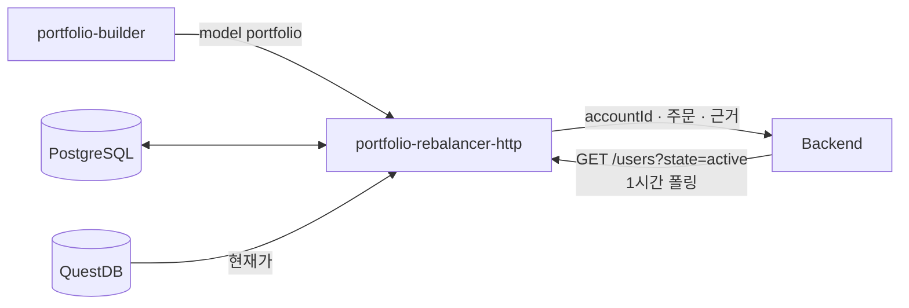
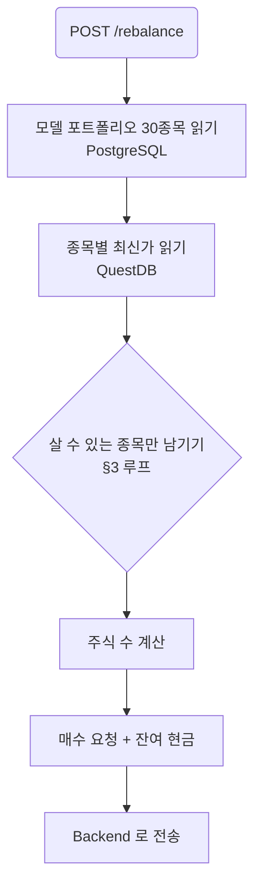
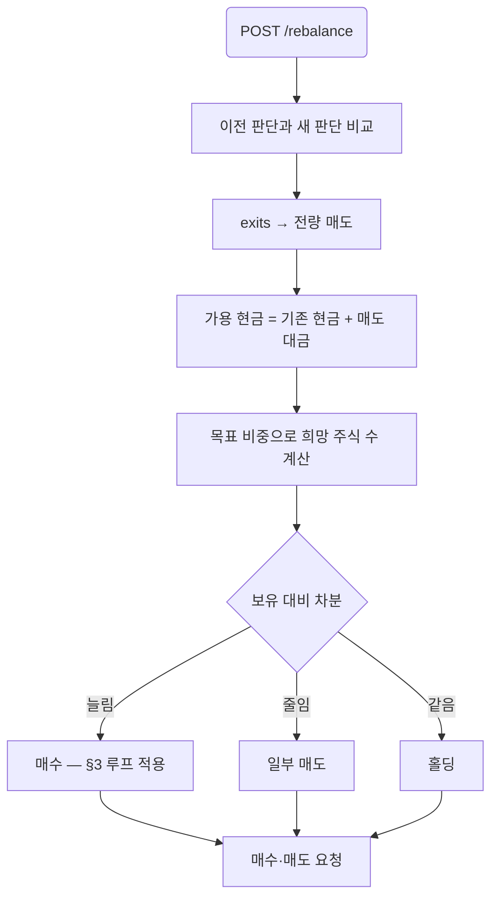

# portfolio-rebalancer-http — Design

**Date:** 2026-09-28
**Status:** Draft — the reserve-list decision needs the team's agreement before implementation
**Issue:** #43
**Depends on:** #46 (service skeleton, merged), #42 (model portfolio and its tables)

## 1. What it is for

A model portfolio is **relative weights**. A user has **an amount of money** and can only
buy **whole shares**. Those three facts do not always fit together, and this service is
where they are reconciled.

The example that defines the problem: capital 10,000,000 KRW, SK하이닉스 at weight 5%, so a
budget of 500,000 KRW. One share costs 1,800,000 KRW. The weight says buy it; the price says
it cannot be bought at all. The portfolio has to be adjusted to something the user can
actually hold.

### In scope

- The **initial purchase**: given capital and the model portfolio, decide what to buy and
  how many shares.
- **Later rebalances**: portfolio-builder has already decided what to sell and hold, so the
  proceeds of the sells become cash, and that cash has to be spent on what is buyable.

### Not in scope

- Choosing *which* companies belong in the portfolio. That is portfolio-builder's job.
  This service only removes what cannot be bought and pulls in the next candidate.
- Placing orders. It emits buy and sell requests; the Backend executes them.
- Fees, taxes, and slippage.

## 2. Where it sits



`PRH` reads QuestDB directly for prices. There is no MCP server to ask — it was removed
(#50) — and in any case services in this repository communicate through datastores; the HTTP
edges `AGENTS.md` allows are exceptions the architecture chose deliberately, not a licence to
add more.

**Two of those edges are not in issue #43's diagram**, which connects `PRH` to PostgreSQL
only: the QuestDB read for prices, and the hourly poll of the Backend for user accounts. The
diagram needs both.

### User accounts arrive by polling, once an hour

`PRH` polls `GET /users?state=active` every hour. Each active user carries an account:

| field | use |
|---|---|
| `account_id` | identifies the account an order is placed against |
| `is_ai_managed` | only an AI-managed account is rebalanced |
| `is_active` | an inactive account is skipped |
| `cash_balance` | the cash available to spend |
| `stocks[]` — `stock_id`, `amount`, `total_price` | what is held: quantity, and the principal put into it |
| `pending_orders[]` | orders already placed and not yet filled |

**`pending_orders` has to be subtracted before anything is decided.** The poll is hourly, so
between two polls an order may fill, partly fill, or sit. An order already placed for a
company must not be placed again, and cash already committed to a pending buy is not cash this
service may spend. So the starting position is:

```
available cash = cash_balance − Σ(pending buys: price × amount)
held quantity  = stocks[].amount + Σ(pending buys for it) − Σ(pending sells for it)
```

A holding's `total_price` is the principal invested, not a current value, so the current
position still has to be priced from QuestDB.

## 3. The affordability rule

### The list

The model portfolio is a ranked list. The first `MAIN_SIZE` companies carry weights and are
the portfolio; everything after them is a **reserve that carries no weight at all**. A reserve
company has a rank and nothing else until a main company turns out to be unbuyable, and only
then does it receive weight.

That is the point of the reserve carrying no weight: portfolio-builder is not asked to
value a company it does not intend to hold. It ranks candidates, weights the ones it holds,
and the rest exist only as an ordered answer to "what next".

When a main company cannot be bought it is dropped and the next reserve company takes its
place. Drop ranks 1 and 2, and ranks `MAIN_SIZE + 1` and `MAIN_SIZE + 2` come in. A company
entering from the reserve is given weight by renormalising: the set is re-weighted over
whatever the surviving main companies were worth relative to each other, and the newcomer
takes an equal share of what the dropped company left behind.

If the reserve runs out and companies are still unaffordable, they are dropped and their
weight is redistributed over what remains — the portfolio simply gets smaller.

### The floor is a number, not a rule

`MAIN_SIZE` defaults to **10** and is one constant. Changing the portfolio from ten companies
to twenty is that number and nothing else: the loop, the weighting and the reserve handling
are written in terms of it. The same holds on the portfolio-builder side, where it becomes
the `minItems` the submission schema enforces.

Ten is a floor rather than an exact count because the alternative fails badly. An exact
`minItems: 30` makes the tool call itself fail in a week when the news supports only
twenty-two convictions, and the model then pads the list to satisfy the schema — which is
precisely what the grounding rule ("every stored reason must originate in the data") exists to
prevent. A floor lets the reserve be short, or empty, and §3 already handles an exhausted
reserve.

### The loop

Budgets depend on which companies are in the set, and changing the set changes every budget.
So the decision is iterative:

```
selected = candidates[:MAIN_SIZE]          # these carry weights
reserve  = candidates[MAIN_SIZE:]          # these carry none, only rank

loop:
    renormalise weights over `selected`    # a weightless newcomer takes the
                                           # share the dropped company vacated
    budget_i = capital_available * weight_i
    shares_i = floor(budget_i / price_i)
    unaffordable = { i : shares_i == 0 }
    if unaffordable is empty:
        break
    for each unaffordable company:
        remove it from `selected`
        if `reserve` is not empty:
            take the front of `reserve`, give it the vacated weight, add to `selected`
```

A company arriving from the reserve has no weight of its own, so it inherits the weight of
the company it replaces. Renormalising afterwards is what keeps the set summing to one.

Two properties make this terminate and behave sensibly:

- **Removing a company only helps the others.** Renormalising over a smaller set raises every
  remaining weight, so a company that was affordable stays affordable.
- **Adding a reserve company can hurt.** It lowers everyone else's weight, which is exactly
  why the loop has to run again rather than substituting once.
- The reserve is finite and a dropped company never returns, so the loop ends.

### When a company cannot be bought, its weight is shared out equally

A company whose whole budget cannot cover one share is dropped, and **its weight is
distributed equally over the companies that remain** — not in proportion to what they already
hold. Equal keeps a single expensive name from being absorbed by whichever holding happened
to be largest.

If a reserve company is available it is called up in that company's place, taking the vacated
weight (§3). The equal split applies to whatever weight is left over after the reserve is
exhausted.

### The residual pass — two phases

Flooring each budget to whole shares leaves cash, and that cash is worth spending: measured
over ten weights on 10,000,000, flooring alone leaves 8–13% idle, which is a different
portfolio from the one portfolio-builder decided on.

The residual is spent one share at a time, in two phases:

1. **Fill the shortfalls.** Buy one share of whichever company is furthest below its target
   *amount* (`capital × weight`), and repeat. Companies that were dropped as unaffordable take
   no part.
2. **Then go round the weights.** Once no company is below its target amount, cycle the
   companies in descending weight order, buying one share each time round.

Both phases stop when the cash cannot cover any held company's share price. What is left then
stays as cash.

Phase two is not a corner case. Over 20,000 randomly generated portfolios (2–12 companies,
prices 1,000–500,000, capital 100,000–100,000,000) it fired in **6,336** of them, 32%. It
happens when prices vary enough that closing a gap overshoots it: every target ends up
satisfied while cash is still on the table.

Measured on one such portfolio — five companies at weights 0.40/0.25/0.20/0.10/0.05, prices
73,000 / 412,000 / 155,000 / 28,500 / 9,000, capital 42,590,000:

| | after flooring | phase 1 | phase 2 | final |
|---|---|---|---|---|
| cash | 540,500 | 4 shares bought | 2 shares bought | **0** |

Final weights land at 0.401 / 0.252 / 0.197 / 0.100 / 0.051 against targets of
0.40 / 0.25 / 0.20 / 0.10 / 0.05.

**Distributing the residual equally does not work**, which is worth recording because it is the
obvious thing to try. Ten companies with 1,300,000 left over gives each 130,000; at a 300,000
share price nobody can buy anything, the loop stalls immediately, and 13% of the capital sits
in cash. Equal division is right for a *weight* being given up (above) and wrong for cash.

### Worked example

Capital 10,000,000, `MAIN_SIZE` 10. Suppose the main ten renormalise so SK하이닉스 sits at 5%.

| | rank | weight | budget | price | shares | result |
|---|---|---|---|---|---|---|
| SK하이닉스 | 3 | 5% | 500,000 | 1,800,000 | 0 | unaffordable — dropped |
| (reserve) | 11 | — | — | — | — | enters, takes the vacated 5% |
| 삼성전자 | 1 | 8% | 800,000 | 78,000 | 10 | 780,000 spent, 20,000 residual |

The reserve company had no weight until this moment. It has one now because SK하이닉스 left
one behind.

## 4. The two flows

### Initial purchase



### Later rebalance

portfolio-builder has already compared the previous portfolio against the news and produced
holdings and exits. The order of operations matters: **sells free the cash the buys need.**



The affordability loop applies to the buy side only. A sell is always possible, so a target
weight that is unreachable by buying does not block the sells that fund it.

## 5. The interface

```
POST /rebalance
GET  /rebalance/{portfolio_id}
GET  /health
```

`POST /rebalance` is **idempotent on `portfolio_id`**: buying and selling cannot be undone,
and portfolio-builder may retry. A second call for a portfolio already processed returns the
stored result and sends nothing to the Backend. That needs a table — see §7.

Response shape, per company:

```json
{
  "portfolio_id": 42,
  "capital": 10000000,
  "cash_remaining": 512300,
  "orders": [
    {"company_id": "00126380", "stock_code": "005930", "action": "buy",
     "shares": 10, "price": 78000, "weight": 0.08, "reason": "..."},
    {"company_id": "00164779", "stock_code": "000660", "action": "skip",
     "shares": 0, "price": 1800000, "weight": 0.05,
     "note": "one share costs more than the budget; replaced by rank 21"}
  ],
  "replaced": [{"dropped": "000660", "added": "247540"}]
}
```

`stock_code` travels with `company_id` because `company_id` is DART's `corp_code`, which no
exchange accepts as an order identifier.

### Orders go back to the Backend with their reason

An order carries the `account_id` it belongs to, what to do, and **why** — the reason
portfolio-builder stored on that holding (`portfolio_holdings.reason`) or on the exit
(`portfolio_exits.reason`). The model portfolio is grounded by construction, and the order
that acts on it carries that grounding with it.

## 6. The price, and how stale it is

The only price available is the newest close in QuestDB's `bars_1m`:

```sql
SELECT close FROM bars_1m WHERE symbol = $1 ORDER BY ts DESC LIMIT 1
```

**Its freshness is the collector's cron period, not the market.** `dev`'s market-collector is
an archive job — `live.py` and the WebSocket path were removed — so it writes whenever the
job runs, not continuously.

That matters here in a way it does not elsewhere. Affordability is a threshold: a stale price
of 1,750,000 against a budget of 1,800,000 says "buyable" when the real price has moved to
1,850,000 and it is not. The order then fails at the Backend, or fills at a size we did not
plan.

Two ways to live with it, neither free:

- **A safety margin.** Require `budget >= price × (1 + margin)` so a price that moved against
  us still fits. Costs a little accuracy in exchange for fewer failed orders.
- **Report the price's age.** Return the `ts` of the close used so the Backend can refuse a
  price older than it is willing to trade on.

Doing both is cheap and I would do both.

## 7. What has to be decided before this is built

1. **The ranked list with a weightless reserve.** Today portfolio-builder produces no fixed
   count and `portfolio_holdings` has no `rank` column — weight descending is the only
   ordering, and every holding carries weight. Three changes to #42 follow:
   - the prompt asks for a ranked list with at least `MAIN_SIZE` weighted holdings and a
     reserve after them,
   - `submit_portfolio` takes `rank` per company and allows `weight` to be absent for reserve
     entries, with `minItems: MAIN_SIZE`,
   - `portfolio_holdings` gains `rank` (and `weight` becomes nullable, or reserve entries move
     to their own table).

   **Rank cannot be inferred from weight**: a reserve company has no weight, and even among
   the main companies the model may rank a company above one it weights more heavily.
   **This is the one that needs the team's agreement.**
2. ~~Where the user's holdings and cash come from.~~ **Settled: an hourly poll of
   `GET /users?state=active`** (§2). What remains open is whether `PRH` keeps the last poll in
   PostgreSQL or holds it in memory. In memory is simpler but loses everything on restart and
   makes the idempotency record (§7.4) the only history.
3. ~~The Backend endpoint.~~ **Settled: orders carry `account_id`, the order, and the
   reason** (§5). The URL itself still has to be configured.
4. **A table for idempotency.** `rebalance_requests(portfolio_id, user_id, capital, payload,
   created_at, sent_at, status)` with a unique key. That is migration `0006`.
5. ~~Whether `cash_weight` is a floor.~~ **Settled: the model portfolio has no cash weight.**
   It is stocks and their weights, nothing else. Cash exists only as what the residual pass
   could not spend. #42 currently stores `portfolios.cash_weight` and takes it as a
   `submit_portfolio` argument, so that column and argument come out.
6. **The QuestDB edge in #43's diagram**, per §2.

## 8. Code sketch

Two modules beside #46's skeleton, so the affordability rule stays testable without a
database and the app keeps its routes out of `__main__.py`.

`allocate.py` — pure, no I/O:

```python
@dataclass(frozen=True)
class Candidate:
    company_id: str
    stock_code: str
    rank: int
    weight: float | None   # None for a reserve entry until it is called up


@dataclass(frozen=True)
class Allocation:
    company_id: str
    stock_code: str
    shares: int
    price: float
    weight: float


MAIN_SIZE = 10  # the portfolio's size; the reserve is whatever follows it


def allocate(
    candidates: Sequence[Candidate],   # rank order; reserve entries have weight None
    prices: Mapping[str, float],       # stock_code -> price
    capital: float,
    main_size: int = MAIN_SIZE,
    margin: float = 0.0,
) -> tuple[list[Allocation], list[tuple[str, str]], float]:
    """Whole-share allocations, the replacements made, and the residual cash.

    Drops a candidate whose budget cannot cover one share, pulls the next reserve
    candidate in its place, and repeats -- adding a candidate lowers every other
    budget, so one pass is not enough.
    """
    selected = list(candidates[:main_size])
    reserve = deque(candidates[main_size:])
    replaced: list[tuple[str, str]] = []

    while True:
        total = sum(c.weight for c in selected)
        budgets = {c.company_id: capital * c.weight / total for c in selected}
        unaffordable = [
            c for c in selected
            if prices[c.stock_code] * (1 + margin) > budgets[c.company_id]
        ]
        if not unaffordable:
            break
        for dropped in unaffordable:
            selected.remove(dropped)
            if reserve:
                added = reserve.popleft()
                selected.append(added)
                replaced.append((dropped.stock_code, added.stock_code))

    allocations = [
        Allocation(
            company_id=c.company_id,
            stock_code=c.stock_code,
            shares=int(budgets[c.company_id] // prices[c.stock_code]),
            price=prices[c.stock_code],
            weight=c.weight / total,
        )
        for c in selected
    ]
    spent = sum(a.shares * a.price for a in allocations)
    return allocations, replaced, capital - spent


def spend_residual(
    shares: dict[str, int],
    prices: Mapping[str, float],
    ideal: Mapping[str, float],   # capital * weight, per company
    residual: float,
) -> tuple[dict[str, int], float]:
    """Spend what flooring left over, one share at a time, in two phases.

    Phase one buys for whichever company is furthest below its ideal amount. Once no
    company is below it, phase two cycles the companies in descending weight order,
    one share each time round. Both stop when the cash covers no share price, and
    what is left is cash.
    """
    ring = cycle(sorted(ideal, key=lambda s: -ideal[s]))
    while True:
        affordable = [s for s in shares if prices[s] <= residual]
        if not affordable:
            break
        short = [s for s in affordable if shares[s] * prices[s] < ideal[s]]
        if short:
            pick = max(short, key=lambda s: ideal[s] - shares[s] * prices[s])
        else:
            pick = next((c for c in islice(ring, len(shares)) if prices[c] <= residual), None)
            if pick is None:
                break
        shares[pick] += 1
        residual -= prices[pick]
    return shares, residual
```

`prices.py` — the QuestDB read, the only module that touches a database:

```python
def latest_prices(dsn: str, stock_codes: Sequence[str]) -> dict[str, tuple[float, datetime]]:
    """The newest close per symbol, with the timestamp so a caller can judge its age."""
```

Tests worth having, because each pins a property the loop has to hold:

- a portfolio every name of which is affordable allocates exactly `MAIN_SIZE` and replaces
  nothing
- one unaffordable name pulls in exactly rank `MAIN_SIZE + 1`
- two unaffordable names pull in ranks `MAIN_SIZE + 1` and `MAIN_SIZE + 2`
- a company called up from the reserve ends with the weight the dropped company vacated
- changing `MAIN_SIZE` from 10 to 20 changes the size of the result and nothing else about
  the behaviour
- a replacement that is itself unaffordable pulls the next one, and the loop still ends
- an exhausted reserve drops the name and redistributes over the remainder
- residual cash never goes negative, and after the residual pass it is below the cheapest
  held share price
- **phase one runs before phase two**: a company below its ideal amount always takes the share
  ahead of the weight cycle
- **phase two is reached**: a portfolio whose gaps all close while cash remains cycles the
  weights rather than stopping. It is not dead code — 32% of 20,000 random portfolios reach it
- a dropped company's weight is split **equally**, not proportionally, over what remains
- distributing the *residual* equally leaves it unspent when the per-company slice is under a
  share price — the case that rules equal division out for cash
- a margin of zero and a positive margin differ only where the budget is within the margin
