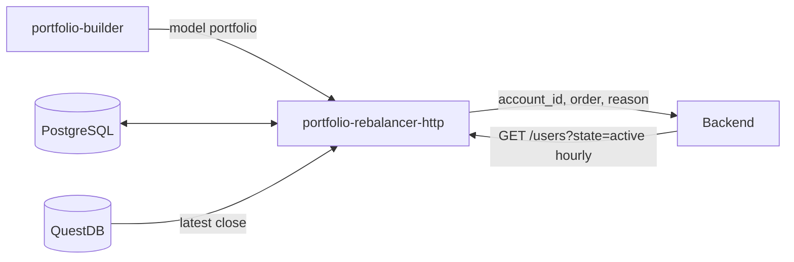
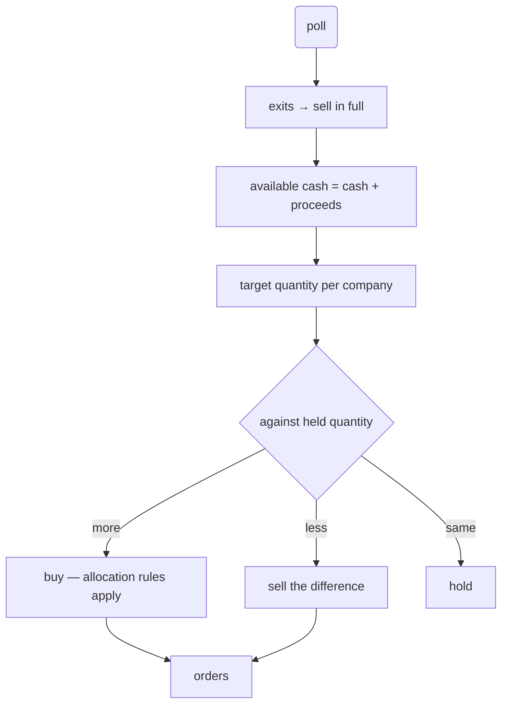

# Portfolio Rebalancer Design

## Purpose

A model portfolio is relative weights. A user has an amount of money and can only buy whole
shares. `portfolio-rebalancer-http` reconciles the three and emits the buy and sell requests
that move an account toward the portfolio.

The problem that defines the service: capital 10,000,000 with SK하이닉스 at 5% gives a budget
of 500,000, and one share costs 1,800,000. The weight says buy it; the price says it cannot be
bought at all.

## Scope

The service will:

- read the current model portfolio and the previous one from PostgreSQL;
- rebalance every AI-managed, active account separately, using only that account's own cash, holdings and pending orders;
- poll the Backend hourly for active users, their holdings, cash and pending orders;
- read the latest close per symbol from QuestDB;
- decide which companies can be bought and at what whole-share quantity;
- emit buy and sell requests to the Backend with the reason behind each;
- record what it ordered so a restart does not order twice.

The service will not choose which companies belong in the portfolio, place orders at the
exchange, round prices to exchange ticks, or account for fees, taxes and slippage.

## Position in the System



Prices come from QuestDB directly. Services in this repository communicate through datastores,
and the HTTP edges `AGENTS.md` allows are exceptions the architecture chose deliberately.

Issue #43's diagram connects `PRH` to PostgreSQL only. Both the QuestDB read and the Backend
poll have to be added to it.

## Account State

`GET /users?state=active` is polled once an hour. Each active user carries one or more accounts,
and every account is decided on its own:

| field | use |
|---|---|
| `account_id` | identifies the account an order is placed against; one user has several |
| `is_ai_managed` | only an AI-managed account is rebalanced |
| `is_active` | an inactive account is skipped |
| `cash_balance` | cash before pending commitments |
| `stocks[]` — `stock_id`, `amount`, `total_price` | quantity held, and the principal put into it |
| `pending_orders[]` | orders placed and not yet filled |

Pending orders are subtracted before anything is decided. The poll is hourly, so between two
polls an order may fill, partly fill, or sit. Cash committed to a pending buy is not cash this
service may spend:

```
available cash = cash_balance − Σ(pending buys: price × amount)
held quantity  = stocks[].amount + Σ(pending buys) − Σ(pending sells)
```

A holding's `total_price` is principal, not a current value, so the position is priced from
QuestDB like everything else.

The poll carries both the user and the account, and both are stored. It is written to PostgreSQL
as **the latest state, not a history**, replaced each time. Five tables, and only
`rebalance_orders` accumulates:

| table | from the payload | contents |
|---|---|---|
| `users` | `user_id`, `nickname`, `state` | one row per user |
| `accounts` | `account_id`, `account_name`, `is_ai_managed`, `is_duel_account`, `is_active`, `cash_balance` | one row per account; a user has several |
| `account_holdings` | `stocks[]` — `stock_id`, `amount`, `total_price` | what the account holds, per account |
| `account_pending_orders` | `pending_orders[]` — `order_type`, `status`, `stock_code`, `price`, `amount` | orders still outstanding, per account |
| `rebalance_orders` | — | **history** — every order this service sent, and why |

Three columns are renamed, because the Backend's names say less than they mean: `amount` becomes
`quantity`, `total_price` becomes `principal` (money put in, not what the position is worth), and
`stock_id` becomes `stock_code` so a holding and a pending order name the same thing the same way.

Account state is a mirror of the Backend and is only read back to decide the next order, so
keeping old copies would grow with users × hours and answer no question worth asking. What has to
be traceable is the orders, and those accumulate.

**A user has several accounts, and each account has its own holdings and its own pending orders.**
The example payload spells `accounts` as an object, but it is a list. So the poll is walked user
by user, then account by account, and nothing about an account is shared with its siblings — cash,
holdings and pending orders are all per account, and so is the rebalance decision.

`stocks[].stock_id` and `pending_orders[].stock_code` are the same thing under two names, and
`stock_code` is the one used throughout: in the tables, in the price lookup, and in the orders
sent back.

## Allocation

`cash_weight` comes from the model portfolio and does two jobs. It is held back before any
budget is computed, so the money available for stocks is `capital × (1 − cash_weight)`, and
whatever the residual pass cannot spend is added back to it. The cash actually held is
therefore at least `cash_weight` and usually a little more; a report should distinguish the two,
because "we chose to hold 10%" and "3% would not buy anything" are different facts.

The model portfolio has no ranking and no reserve list. A company whose budget cannot cover one
share is dropped and **its weight is shared equally over the companies that remain** — equal,
not in proportion, so one expensive name is not absorbed by whichever holding happened to be
largest. If nothing can be bought, the whole amount is cash.

Dropping a company changes every budget, so the decision iterates:

```
investable = capital × (1 − cash_weight)

loop:
    budget_i = investable × weight_i / Σ weights
    if every company can afford one share: break
    drop the companies that cannot
    share their weight equally over those that remain
```

An equal share of freed weight raises every remaining budget, so a company that was affordable
stays affordable. The set only shrinks, so the loop ends.

### The Residual Pass

Flooring each budget to whole shares leaves cash worth spending. Measured over ten weights on
10,000,000, flooring alone leaves 8–13% idle, which is a different portfolio from the one
portfolio-builder decided on.

The residual is spent one share at a time, in two phases:

1. **Fill the shortfalls.** Buy one share of whichever company is furthest below its target
   amount (`investable × weight`), and repeat. Dropped companies take no part.
2. **Then go round the weights.** Once no company is below its target amount, cycle the
   companies in descending weight order, one share each time round.

Both stop when the cash covers no held company's share price. What is left joins `cash_weight`.

Phase two is not a corner case: over 20,000 randomly generated portfolios (2–12 companies,
prices 1,000–500,000, capital 100,000–100,000,000) it fired in 6,336, or 32%. It happens when
prices vary enough that closing a gap overshoots it, leaving every target satisfied while cash
remains.

Distributing the residual **equally** does not work, which is worth recording because it is the
obvious thing to try. Ten companies with 1,300,000 left over get 130,000 each; at a 300,000
share price nobody can buy anything, the loop stalls, and 13% of capital sits idle. Equal
division is right for a weight being given up and wrong for cash.

## Order Ladder

An order is not sent at market first. Each one goes out as **two reservations around a reference
price**, both for the full quantity:

```
reference 78,000, step ± 5%   →   74,100 × 100 shares   and   81,900 × 100 shares
```

Whichever fills, fills, and **the Backend cancels the other**. The low side alone risks never
filling; the high side is what makes the fill happen.

The band narrows once per trading day, and the third day ends in a market order rather than a
fourth band, so **every order fills within three trading days**:

| day | band |
|---|---|
| 1 | reference ± 5% |
| 2 | reference ± 3% |
| 3 | reference ± 1%, then market if that does not fill |

The market rung is what guarantees the fill; narrowing does not. A ± 1% band is *harder* to
reach than ± 5%, so a price that has walked away from the reference is less likely to come back
inside the narrow band than the wide one. The pair chases a better price for three days and then
stops chasing. Limit-up and limit-down days stop mattering for the same reason.

The reference is fixed when the first pair is placed — the previous session's close — and every
later step is measured from that same number, not from whatever the close has become since.

### The Step Is Read Back From the Pair

Nothing has to be stored, and the Backend does not have to carry the reference on the order.
Two prices determine both unknowns:

```
reference = (low + high) / 2
ratio     = (high − low) / (high + low)
```

Measured across six reference prices and all three bands, with the Backend's tick rounding
applied first: the reference comes back exactly in all eighteen cases and the ratio within 0.05
percentage points — 2.949% for a 3% band at worst. The bands are two points apart, so nothing is
ambiguous. Two pending orders for the same company and side are one pair.

## Rebalance Flow

The initial purchase needs only capital and the model portfolio.

A later rebalance works from what portfolio-builder has already decided — holdings to keep and
exits to sell — and **sells before it buys**, because the proceeds of the sells are part of the
cash the buys spend.



The allocation rules apply to the buy side only. A sell is always possible, so a target weight
that cannot be reached by buying does not block the sells that fund it.

## Interface

```
POST /rebalance
GET  /rebalance/{portfolio_id}
GET  /health
```

Every call to the Backend carries a token. **How the token is issued is not settled yet**, so
the HTTP client is kept behind one module (`backend.py`) with the token acquisition isolated in
it: whichever way it is finally issued, nothing outside that module changes. `market-collector`
is the precedent — its Kiwoom client holds its own token store and nothing else knows about it.

An order carries the `account_id` it belongs to, what to do, and why — the reason
portfolio-builder stored on that holding (`portfolio_holdings.reason`) or on the exit
(`portfolio_exits.reason`). The model portfolio is grounded by construction and the order that
acts on it carries that grounding with it.

`stock_code` travels with `company_id` because `company_id` is DART's `corp_code`, which no
exchange accepts as an order identifier. Prices are sent unrounded; the Backend rounds them to
a valid KRX tick.

```json
{
  "portfolio_id": 42,
  "account_id": 11,
  "capital": 10000000,
  "cash": {"target": 500000, "unspent": 118000},
  "orders": [
    {"company_id": "00126380", "stock_code": "005930", "action": "buy", "shares": 10,
     "reference": 78000, "band": 0.05, "low": 74100, "high": 81900,
     "weight": 0.08, "reason": "..."},
    {"company_id": "00164779", "stock_code": "000660", "action": "skip", "shares": 0,
     "price": 1800000, "weight": 0.05,
     "note": "one share costs more than the budget; its weight was shared out equally"}
  ]
}
```

## Failure Handling

**A stale price can misjudge affordability.** The only price available is the newest close in
QuestDB's `bars_1m`, and its freshness is the collector's cron period, not the market's — `dev`'s
market-collector is an archive job with no live path. Affordability is a threshold, so a stale
1,750,000 against a budget of 1,800,000 says "buyable" when the real price has moved to
1,850,000 and it is not. Two cheap mitigations, both worth having: require
`budget ≥ price × (1 + margin)`, and return the `ts` of the close used so the Backend can refuse
a price older than it will trade on.

**Duplicate orders need less guarding than they appear to.** The poll returns only orders that
are still pending, so a filled order leaves `pending_orders` and appears in `stocks[]`. The next
poll computes the target against the new holdings, finds no gap, and places nothing.

One window remains: between placing a pair and the poll that first reports it, this service has
no record that it acted. A restart there, or a Backend lagging a poll behind, would see the old
holdings and place the pair again. Writing the order to PostgreSQL at the moment it is placed —
not only what the poll reports back — closes it. That record is keyed on
`(portfolio_id, account_id)` and is migration `0006`.

## Deferred

**An outstanding pair when the next weekly judgement lands.** Three daily steps need three
trading days, so the ladder finishes inside any week with three or more of them:

| holidays | trading days | finishes |
|---|---|---|
| 0 | 5 | Wednesday |
| 1 | 4 | Thursday |
| 2 | 3 | Friday |
| 3 or more | 2 or fewer | runs into the next week |

Only a week cut to two trading days overflows, which in practice means a Seollal or Chuseok
week. **The intended behaviour is to cancel the outstanding pair** and let the new portfolio's
order replace it — a judgement that has changed is not worth filling the old order for. It is
not implemented in this version, because the case is rare enough that the handling can wait.

**How the Backend token is issued** is not settled. It is confined to `backend.py` so settling
it later touches one file, and no pure module ever sees a token.

## Code Structure

Eight modules beside the skeleton, split so that everything with a rule in it can be tested
without a database or a socket. The four pure modules hold every decision; the three I/O
modules hold no decisions at all.

| module | kind | responsibility |
|---|---|---|
| `allocate.py` | pure | weights and prices to whole shares |
| `reservations.py` | pure | an order to its two prices, and back again |
| `accounts.py` | pure | fold pending orders into cash and holdings |
| `rebalance.py` | pure | sells then buys, with reasons attached |
| `prices.py` | I/O | the latest close from QuestDB |
| `backend.py` | I/O | the token, the account poll, the order send |
| `store.py` | I/O | the account mirror and the order history in PostgreSQL |
| `app.py` | routes | calls the above in order |

`allocate.py`:

```python
@dataclass(frozen=True)
class Target:
    """A company in the model portfolio, with the weight it should carry."""
    company_id: str
    stock_code: str
    weight: float


@dataclass(frozen=True)
class Position:
    """How much of one company to hold, once whole shares are accounted for."""
    company_id: str
    stock_code: str
    shares: int
    price: float
    weight: float


def allocate(
    targets: Sequence[Target],
    prices: Mapping[str, float],
    capital: float,
    cash_weight: float,
    margin: float = 0.0,
) -> tuple[list[Position], float]:
    """Positions to hold, and the cash left un-invested.

    A company whose budget cannot cover one share is dropped and its weight is shared
    equally over the rest, not in proportion. Removing a company only raises the
    remaining budgets, so the loop only shrinks the set and ends. The cash returned is
    `capital * cash_weight` plus whatever `spend_leftover` could not spend.
    """


def spend_leftover(
    shares: dict[str, int],
    prices: Mapping[str, float],
    ideal: Mapping[str, float],
    leftover: float,
) -> tuple[dict[str, int], float]:
    """Spend what whole-share rounding left behind, one share at a time.

    First for whichever company is furthest below its ideal amount; once none is below
    it, round the companies in descending weight order. Both stop when the cash covers
    no share price.
    """
```

`reservations.py`:

```python
PRICE_BANDS: tuple[float, ...] = (0.05, 0.03, 0.01)   # day three ends at market


def reservation_prices(reference: float, day: int) -> tuple[float, float] | None:
    """The low and high price for a day, or None once the ladder is at market."""


def read_reservation(low: float, high: float) -> tuple[float, int]:
    """The reference price and the day, recovered from an outstanding pair.

    Neither is stored. Two prices fix both, and the recovered ratio lands within 0.05
    points of its band against bands two points apart.
    """
```

`accounts.py`:

```python
@dataclass(frozen=True)
class AccountState:
    """What an account can actually spend and what it actually holds."""
    account_id: int
    cash: float
    held: dict[str, int]          # stock_code -> quantity


def apply_pending(account: Mapping[str, object]) -> AccountState:
    """Fold outstanding orders into the numbers.

    Cash committed to a pending buy is not spendable, and a pending order moves the
    quantity the account is on its way to holding. `total_price` is ignored: it is the
    principal put in, not what the position is worth now.
    """


def managed_accounts(users: Sequence[Mapping[str, object]]) -> Iterator[Mapping[str, object]]:
    """Only the accounts that are both AI-managed and active."""
```

`rebalance.py`:

```python
def rebalance(
    portfolio: Portfolio,
    account: AccountState,
    prices: Mapping[str, float],
) -> list[Order]:
    """Sells first, then buys with the cash they free.

    A sell is always possible, so a target weight that cannot be reached by buying does
    not block the sells that fund it.
    """
```

`backend.py`:

```python
def fetch_accounts(client: Client, token: str) -> list[Mapping[str, object]]:
    """GET /users?state=active."""


def send_orders(client: Client, token: str, orders: Sequence[Order]) -> None:
    """Place each order as its pair of reservations."""
```

The token lives in this module and nowhere else, so settling how it is issued changes one
file.

## Verification

Each test pins a property the rules have to hold.

Allocation:

- a portfolio every name of which is affordable allocates all of them and drops none;
- an unaffordable name is dropped and its weight is split equally, not proportionally;
- dropping one name never makes another unaffordable;
- every name unaffordable puts the whole amount in cash;
- `cash_weight` is held back before any budget is computed, and the residual is added to it;
- residual cash never goes negative, and after the residual pass it is below the cheapest held
  share price;
- phase one runs before phase two: a company below its ideal amount takes the share ahead of
  the weight cycle;
- phase two is reached — it is not dead code;
- distributing the leftover equally leaves it unspent when the per-company slice is under a
  share price.

Reservations:

- `read_reservation(*reservation_prices(reference, n)) == (reference, n)` for every day, and
  still after the Backend's tick rounding is applied to both prices;
- two bands never round into each other;
- a pair is recognised from two pending orders on the same company and side, and a lone pending
  order is not mistaken for one;
- day three falls through to a market order rather than a fourth band.

Storage:

- a second poll replaces an account's holdings and pending orders rather than adding to them;
- `rebalance_orders` keeps every order sent, including ones whose pair was later cancelled.

Flow:

- pending buys are subtracted from available cash, and pending orders adjust held quantity;
- an account that is not `is_ai_managed`, or not `is_active`, is skipped;
- sells are emitted before the buys they fund;
- a second `POST /rebalance` for the same `(portfolio_id, account_id)` returns the stored result
  and emits nothing.
