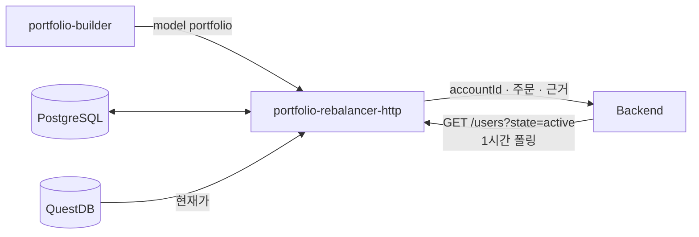
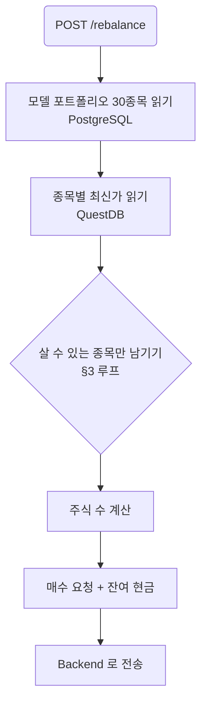
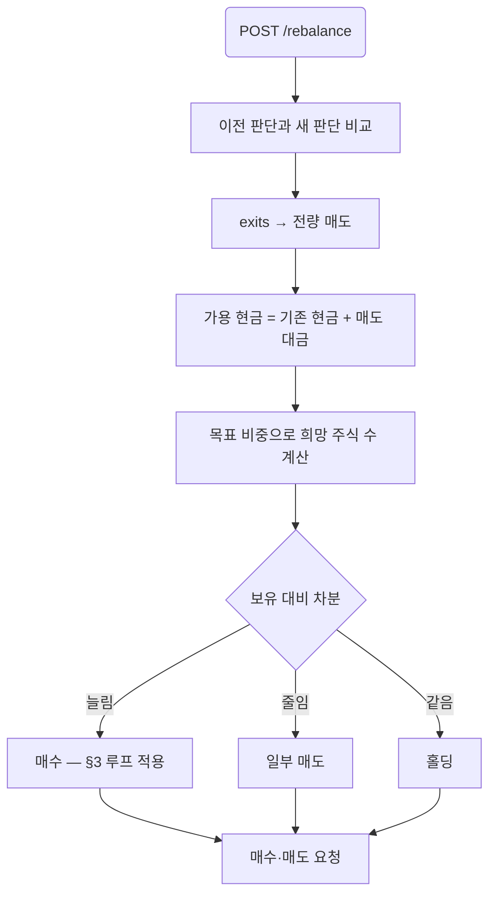

# portfolio-rebalancer-http — Design

**Date:** 2026-09-28
**Status:** Draft — the open items in §8 are with the team
**Issue:** #43
**Depends on:** #46 (service skeleton, merged), #42 (model portfolio and its tables)

## 1. What it is for

A model portfolio is **relative weights**. A user has **an amount of money** and can only
buy **whole shares**. Those three facts do not always fit together, and this service is
where they are reconciled.

The example that defines the problem: capital 10,000,000 KRW, SK하이닉스 at weight 5%, so a
budget of 500,000 KRW. One share costs 1,800,000 KRW. The weight says buy it; the price says
it cannot be bought at all. The portfolio has to be adjusted to something the user can
actually hold.

### In scope

- The **initial purchase**: given capital and the model portfolio, decide what to buy and
  how many shares.
- **Later rebalances**: portfolio-builder has already decided what to sell and hold, so the
  proceeds of the sells become cash, and that cash has to be spent on what is buyable.

### Not in scope

- Choosing *which* companies belong in the portfolio. That is portfolio-builder's job.
  This service only removes what cannot be bought and pulls in the next candidate.
- Placing orders. It emits buy and sell requests; the Backend executes them.
- Fees, taxes, and slippage.

## 2. Where it sits



`PRH` reads QuestDB directly for prices. There is no MCP server to ask — it was removed
(#50) — and in any case services in this repository communicate through datastores; the HTTP
edges `AGENTS.md` allows are exceptions the architecture chose deliberately, not a licence to
add more.

**Two of those edges are not in issue #43's diagram**, which connects `PRH` to PostgreSQL
only: the QuestDB read for prices, and the hourly poll of the Backend for user accounts. The
diagram needs both.

### User accounts arrive by polling, once an hour

`PRH` polls `GET /users?state=active` every hour. Each active user carries an account:

| field | use |
|---|---|
| `account_id` | identifies the account an order is placed against |
| `is_ai_managed` | only an AI-managed account is rebalanced |
| `is_active` | an inactive account is skipped |
| `cash_balance` | the cash available to spend |
| `stocks[]` — `stock_id`, `amount`, `total_price` | what is held: quantity, and the principal put into it |
| `pending_orders[]` | orders already placed and not yet filled |

**`pending_orders` has to be subtracted before anything is decided.** The poll is hourly, so
between two polls an order may fill, partly fill, or sit. An order already placed for a
company must not be placed again, and cash already committed to a pending buy is not cash this
service may spend. So the starting position is:

```
available cash = cash_balance − Σ(pending buys: price × amount)
held quantity  = stocks[].amount + Σ(pending buys for it) − Σ(pending sells for it)
```

A holding's `total_price` is the principal invested, not a current value, so the current
position still has to be priced from QuestDB.

## 3. The affordability rule

### No ranking, no reserve

The model portfolio is companies and their weights, plus a `cash_weight`. There is no rank
and no reserve list. A company that cannot be bought is simply dropped, and **its weight is
distributed equally over the companies that remain** — equal, not in proportion, so a single
expensive name is not absorbed by whichever holding happened to be largest.

If nothing at all can be bought, the money goes to cash.

### cash_weight is both a target and a destination

`cash_weight` is set by portfolio-builder and does two jobs:

- it is **reserved up front**, so the money available for stocks is `capital × (1 − cash_weight)`
- whatever the residual pass still cannot spend is **added to it**

So the cash actually held is at least `cash_weight` and usually a little more. A report should
say which part is which, because "we chose to hold 10% cash" and "3% would not buy anything"
are different facts about the same account.

### The loop

Budgets depend on which companies are in the set, and dropping one changes every budget. So
the decision is iterative:

```
investable = capital * (1 - cash_weight)
selected   = every company in the model portfolio

loop:
    budget_i = investable * weight_i / Σ weights
    if every company can afford one share:
        break
    drop the companies that cannot
    share their weight equally over those that remain
```

Removing a company only helps the others: an equal share of the freed weight raises every
remaining budget, so a company that was affordable stays affordable. The set only shrinks, so
the loop ends.

### The residual pass — two phases

Flooring each budget to whole shares leaves cash, and that cash is worth spending: measured
over ten weights on 10,000,000, flooring alone leaves 8–13% idle, which is a different
portfolio from the one portfolio-builder decided on.

The residual is spent one share at a time, in two phases:

1. **Fill the shortfalls.** Buy one share of whichever company is furthest below its target
   *amount* (`capital × weight`), and repeat. Companies that were dropped as unaffordable take
   no part.
2. **Then go round the weights.** Once no company is below its target amount, cycle the
   companies in descending weight order, buying one share each time round.

Both phases stop when the cash cannot cover any held company's share price. What is left then
stays as cash and joins `cash_weight`.

Phase two is not a corner case. Over 20,000 randomly generated portfolios (2–12 companies,
prices 1,000–500,000, capital 100,000–100,000,000) it fired in **6,336** of them, 32%. It
happens when prices vary enough that closing a gap overshoots it: every target ends up
satisfied while cash is still on the table.

Measured on one such portfolio — five companies at weights 0.40/0.25/0.20/0.10/0.05, prices
73,000 / 412,000 / 155,000 / 28,500 / 9,000, capital 42,590,000:

| | after flooring | phase 1 | phase 2 | final |
|---|---|---|---|---|
| cash | 540,500 | 4 shares bought | 2 shares bought | **0** |

Final weights land at 0.401 / 0.252 / 0.197 / 0.100 / 0.051 against targets of
0.40 / 0.25 / 0.20 / 0.10 / 0.05.

**Distributing the residual equally does not work**, which is worth recording because it is the
obvious thing to try. Ten companies with 1,300,000 left over gives each 130,000; at a 300,000
share price nobody can buy anything, the loop stalls immediately, and 13% of the capital sits
in cash. Equal division is right for a *weight* being given up (above) and wrong for cash.

### Worked example

Capital 10,000,000 with `cash_weight` 0, so 10,000,000 investable over ten companies.

| | weight | budget | price | shares | result |
|---|---|---|---|---|---|
| SK하이닉스 | 5% | 500,000 | 1,800,000 | 0 | unaffordable — dropped |
| 삼성전자 | 8% | 800,000 | 78,000 | 10 | 780,000 spent, 20,000 left |

SK하이닉스's 5% is split equally over the nine that remain, giving each about 0.56 points
more, and the loop runs again with the larger budgets.

## 4. The two flows

### Initial purchase



### Later rebalance

portfolio-builder has already compared the previous portfolio against the news and produced
holdings and exits. The order of operations matters: **sells free the cash the buys need.**



The affordability loop applies to the buy side only. A sell is always possible, so a target
weight that is unreachable by buying does not block the sells that fund it.

## 5. Orders are a narrowing pair, not a market order

An order is never sent at market. Each one goes out as **two reservations around a reference
price**, both for the full quantity:

```
reference 78,000, step 5%    →  74,100  and  81,900
```

Both carry 100 shares if 100 shares are wanted. Whichever fills, fills; **the Backend cancels
the other one.** Placing the low side alone risks never filling at all, and the high side is
what makes the fill happen — the pair is there so that neither outcome is left to chance.

### The band narrows until it fills

| step | band |
|---|---|
| 1 | reference ± 5% |
| 2 | reference ± 3% |
| 3 | reference ± 1% |

A step that has not filled is replaced by the next one, which sits closer to the reference on
both sides. The band only ever narrows, so the price has less and less room to sit outside it.
That is also why a limit-up or limit-down day is not a problem: the pair converges on the
reference long before it reaches either bound.

**The reference is fixed when the first pair is placed** — the previous session's close — and
every later step is measured from that same number, not from whatever the close has become
since. A ladder that spans several days therefore keeps one reference throughout.

Steps advance on a **daily** cadence. The poll runs hourly, so most polls see a pair that is
still outstanding and do nothing.

### The step is read back from the pair

Nothing has to be stored, and the Backend does not have to carry the reference on the order.
Two prices determine both unknowns:

```
reference = (low + high) / 2
ratio     = (high − low) / (high + low)
```

Measured across six reference prices and all three steps, with the Backend's tick rounding
applied first: the reference comes back exactly in all eighteen, and the ratio within 0.05
percentage points — 2.949% for a 3% step at the worst. The steps are two points apart, so
nothing is ambiguous.

Two pending orders for the same company and side are one pair.

### Sells go first

A rebalance sells before it buys. The proceeds of the sells are part of the cash the buys
spend, so a buy placed before its funding sell has filled is a buy that may not be payable.

## 6. The interface

```
POST /rebalance
GET  /rebalance/{portfolio_id}
GET  /health
```

`POST /rebalance` is **idempotent on `portfolio_id`**: buying and selling cannot be undone,
and portfolio-builder may retry. A second call for a portfolio already processed returns the
stored result and sends nothing to the Backend. That needs a table — see §8.

Response shape, per company:

```json
{
  "portfolio_id": 42,
  "capital": 10000000,
  "cash_remaining": 512300,
  "orders": [
    {"company_id": "00126380", "stock_code": "005930", "action": "buy",
     "shares": 10, "price": 78000, "weight": 0.08, "reason": "..."},
    {"company_id": "00164779", "stock_code": "000660", "action": "skip",
     "shares": 0, "price": 1800000, "weight": 0.05,
     "note": "one share costs more than the budget; its weight was shared out equally"}
  ],
  "replaced": [{"dropped": "000660", "added": "247540"}]
}
```

`stock_code` travels with `company_id` because `company_id` is DART's `corp_code`, which no
exchange accepts as an order identifier.

Each order becomes two reservations at the Backend. The prices are sent unrounded; **the
Backend rounds them to a valid KRX tick.**

### Orders go back to the Backend with their reason

An order carries the `account_id` it belongs to, what to do, and **why** — the reason
portfolio-builder stored on that holding (`portfolio_holdings.reason`) or on the exit
(`portfolio_exits.reason`). The model portfolio is grounded by construction, and the order
that acts on it carries that grounding with it.

## 7. The price, and how stale it is

The only price available is the newest close in QuestDB's `bars_1m`:

```sql
SELECT close FROM bars_1m WHERE symbol = $1 ORDER BY ts DESC LIMIT 1
```

**Its freshness is the collector's cron period, not the market.** `dev`'s market-collector is
an archive job — `live.py` and the WebSocket path were removed — so it writes whenever the
job runs, not continuously.

That matters here in a way it does not elsewhere. Affordability is a threshold: a stale price
of 1,750,000 against a budget of 1,800,000 says "buyable" when the real price has moved to
1,850,000 and it is not. The order then fails at the Backend, or fills at a size we did not
plan.

Two ways to live with it, neither free:

- **A safety margin.** Require `budget >= price × (1 + margin)` so a price that moved against
  us still fits. Costs a little accuracy in exchange for fewer failed orders.
- **Report the price's age.** Return the `ts` of the close used so the Backend can refuse a
  price older than it is willing to trade on.

Doing both is cheap and I would do both.

## 8. What is still open

1. **The step cadence.** Daily is the working answer but not settled. It decides how long a
   rebalance takes to complete: three days of narrowing before the band is at 1%.
2. **What happens if the 1% band still does not fill.** The band narrows rather than ending in
   a market order, so there is no final rung that guarantees a fill. Does the pair sit at 1%
   until it fills, or does something else take over?
3. **A ladder still running when the next weekly judgement lands.** portfolio-builder produces
   a new portfolio every week. If a pair from last week's rebalance is still outstanding, is it
   cancelled and replaced, or left to finish?

Settled, and recorded above: the pair and its cancellation (§5), tick rounding at the Backend
(§6), sells before buys (§5), the hourly poll and what has to be subtracted from it (§2), the
reference held fixed and recovered from the pair rather than stored (§5), and `cash_weight`
serving as both a reserve and a destination (§3).

### Idempotency needs less than it first appeared

The poll returns **only orders that are still pending**, so a filled order leaves
`pending_orders` and shows up in `stocks[]` instead. The next poll computes the target against
the new holdings, finds no gap, and places nothing. Seeing the same account every hour is
therefore not, by itself, a source of duplicate orders.

One window remains. Between placing a pair and the poll that first reports it, this service
has no record that it acted. A restart in that window, or a Backend that lags a poll behind,
would see the old holdings and place the pair again. Storing the poll result in PostgreSQL —
which is where it is going anyway — closes it: write what was ordered at the moment it is
ordered, not only what the poll reports back.

## 9. Code sketch

Two modules beside #46's skeleton, so the affordability rule stays testable without a
database and the app keeps its routes out of `__main__.py`.

`allocate.py` — pure, no I/O:

```python
@dataclass(frozen=True)
class Candidate:
    company_id: str
    stock_code: str
    weight: float


def allocate(
    candidates: Sequence[Candidate],
    prices: Mapping[str, float],
    capital: float,
    cash_weight: float,
    margin: float = 0.0,
) -> tuple[list[Allocation], float]:
    """Whole-share allocations and the cash left over.

    A company whose budget cannot cover one share is dropped and its weight is shared
    **equally** over the rest, not in proportion. Removing a company only raises the
    remaining budgets, so the loop only ever shrinks the set and ends.

    The cash returned is `capital * cash_weight` plus whatever the residual pass could
    not spend.
    """


def spend_residual(
    shares: dict[str, int],
    prices: Mapping[str, float],
    ideal: Mapping[str, float],   # investable * weight, per company
    residual: float,
) -> tuple[dict[str, int], float]:
    """Spend what flooring left over, one share at a time, in two phases.

    Phase one buys for whichever company is furthest below its ideal amount. Once no
    company is below it, phase two cycles the companies in descending weight order,
    one share each time round. Both stop when the cash covers no share price.
    """
```

`ladder.py` — pure, no I/O:

```python
STEPS: tuple[float, ...] = (0.05, 0.03, 0.01)


def pair(reference: float, step: int) -> tuple[float, float]:
    """The two reservation prices for a step: (low, high), both full quantity."""
    ratio = STEPS[step]
    return reference * (1 - ratio), reference * (1 + ratio)


def read_pair(low: float, high: float) -> tuple[float, int]:
    """Recover the reference and the step from an outstanding pair.

    Nothing stores either one. Two prices fix both:
        reference = (low + high) / 2
        ratio     = (high - low) / (high + low)
    Verified against the Backend's tick rounding: the reference is exact and the
    ratio lands within 0.05 points of its step, which are two points apart.
    """
    reference = (low + high) / 2
    ratio = (high - low) / (high + low)
    step = min(range(len(STEPS)), key=lambda i: abs(STEPS[i] - ratio))
    return reference, step
```

`prices.py` — the QuestDB read, the only module that touches a database:

```python
def latest_prices(dsn: str, stock_codes: Sequence[str]) -> dict[str, tuple[float, datetime]]:
    """The newest close per symbol, with the timestamp so a caller can judge its age."""
```

Tests worth having, because each pins a property the rules have to hold:

- a portfolio every name of which is affordable allocates all of them and drops none
- an unaffordable name is dropped and its weight is split **equally**, not proportionally
- dropping one name never makes another unaffordable
- every name unaffordable puts the whole amount in cash
- `cash_weight` is held back before any budget is computed, and the residual is added to it
- residual cash never goes negative, and after the residual pass it is below the cheapest
  held share price
- **phase one runs before phase two**: a company below its ideal amount takes the share ahead
  of the weight cycle
- **phase two is reached** — it is not dead code; 32% of 20,000 random portfolios reach it
- distributing the *residual* equally leaves it unspent when the per-company slice is under a
  share price, which is why equal division is used for weight and not for cash
- `read_pair(*pair(reference, n)) == (reference, n)` for every step, and still holds after the
  Backend's tick rounding is applied to both prices
- two steps never round into each other: the recovered ratio is always nearer its own step
  than either neighbour
- a pair is recognised from two pending orders on the same company and side, and a lone
  pending order is not mistaken for one
