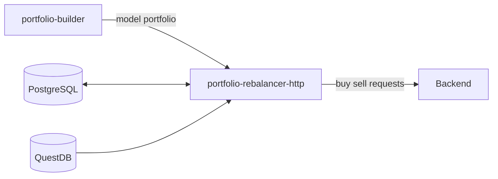
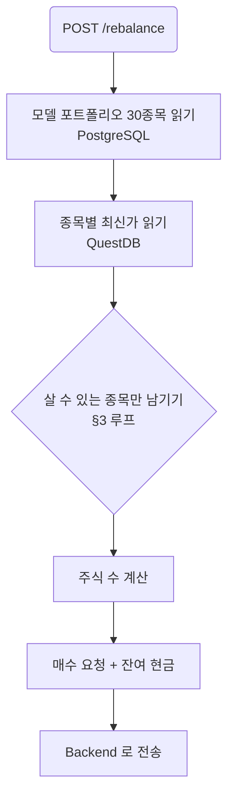
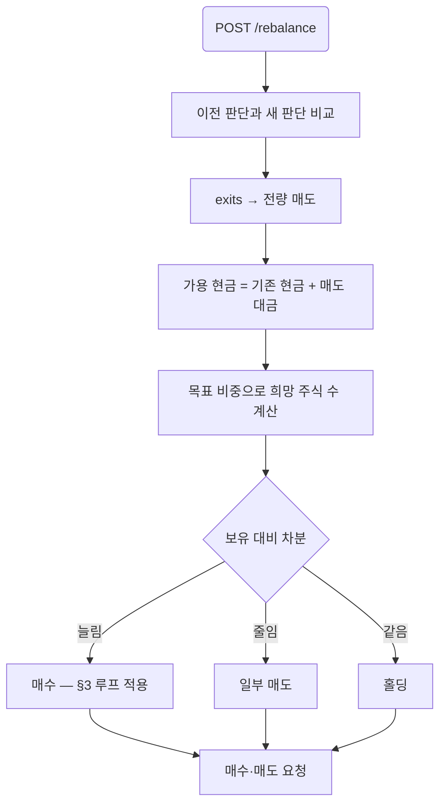

# portfolio-rebalancer-http — Design

**Date:** 2026-09-28
**Status:** Draft — the reserve-list decision needs the team's agreement before implementation
**Issue:** #43
**Depends on:** #46 (service skeleton), #42 (model portfolio and its tables)

## 1. What it is for

A model portfolio is **relative weights**. A user has **an amount of money** and can only
buy **whole shares**. Those three facts do not always fit together, and this service is
where they are reconciled.

The example that defines the problem: capital 10,000,000 KRW, SK하이닉스 at weight 5%, so a
budget of 500,000 KRW. One share costs 1,800,000 KRW. The weight says buy it; the price says
it cannot be bought at all. The portfolio has to be adjusted to something the user can
actually hold.

### In scope

- The **initial purchase**: given capital and the model portfolio, decide what to buy and
  how many shares.
- **Later rebalances**: portfolio-builder has already decided what to sell and hold, so the
  proceeds of the sells become cash, and that cash has to be spent on what is buyable.

### Not in scope

- Choosing *which* companies belong in the portfolio. That is portfolio-builder's job.
  This service only removes what cannot be bought and pulls in the next candidate.
- Placing orders. It emits buy and sell requests; the Backend executes them.
- Fees, taxes, and slippage.

## 2. Where it sits



`PRH` reads QuestDB directly for prices rather than asking `market-analyzer-mcp`. Services
in this repository communicate through datastores; the two HTTP edges `AGENTS.md` allows are
the exceptions the architecture already chose, not a licence to add a third.

**This adds a QuestDB edge that issue #43's diagram does not draw.** The diagram connects
`PRH` to PostgreSQL only. The diagram needs updating, or the price has to arrive some other
way — see §7.

## 3. The affordability rule

### The list

The model portfolio carries **30 companies**, ranked. The top 20 are the portfolio; ranks
21–30 are a reserve. When a top-20 company cannot be bought, the next reserve company takes
its place: drop ranks 1 and 2 and ranks 21 and 22 come in.

If the reserve runs out and companies are still unaffordable, they are dropped and their
weight is redistributed over what remains.

### The loop

Budgets depend on which companies are in the set, and changing the set changes every budget.
So the decision is iterative:

```
selected  = top 20 by rank
reserve   = ranks 21..30 in rank order

loop:
    renormalise weights over `selected`
    budget_i = capital_available * weight_i
    shares_i = floor(budget_i / price_i)
    unaffordable = { i : shares_i == 0 }
    if unaffordable is empty:
        break
    remove unaffordable from `selected`
    pull that many names off the front of `reserve` into `selected`
```

Two properties make this terminate and behave sensibly:

- **Removing a company only helps the others.** Renormalising over a smaller set raises every
  remaining weight, so a company that was affordable stays affordable.
- **Adding a reserve company can hurt.** It lowers everyone else's weight, which is exactly
  why the loop has to run again rather than substituting once.
- The reserve is finite and a dropped company never returns, so the loop ends.

### The residual pass — flooring alone wastes a lot of capital

After the loop, the residual is `capital_available - Σ(shares_i × price_i)`. Each company's
own leftover is less than one of its shares, **but the sum of twenty such leftovers buys many
shares.** Measured, capital 10,000,000 over 20 equal weights:

| prices | residual after flooring |
|---|---|
| all 137,000 | 1,780,000 — **17.8%** |
| all 300,000 | 4,000,000 — **40.0%** |
| random 50,000–400,000 | 2,039,000 — **20.4%** |

Leaving that in cash is not a rounding error, it is a different portfolio from the one
portfolio-builder decided on. So a second pass spends it: while the residual covers any held
company's share price, buy one more share of whichever company is **furthest below its target
weight**, and repeat.

Measured with the same inputs, that pass brings the residual down to where it genuinely
cannot buy anything:

| prices | before | after | extra shares |
|---|---|---|---|
| all 137,000 | 1,780,000 (17.8%) | 136,000 (1.4%) | 12 |
| random 50,000–400,000 | 2,279,000 (22.8%) | 5,000 (0.1%) | 8 |

It terminates because the residual strictly decreases, and picking the largest shortfall keeps
the result closer to the intended weights than buying by rank would.

### Worked example

Capital 10,000,000. Suppose the top 20 renormalise so SK하이닉스 sits at 5%.

| | weight | budget | price | shares | result |
|---|---|---|---|---|---|
| SK하이닉스 | 5% | 500,000 | 1,800,000 | 0 | unaffordable — dropped, rank 21 enters |
| 삼성전자 | 8% | 800,000 | 78,000 | 10 | 780,000 spent, 20,000 residual |

## 4. The two flows

### Initial purchase



### Later rebalance

portfolio-builder has already compared the previous portfolio against the news and produced
holdings and exits. The order of operations matters: **sells free the cash the buys need.**



The affordability loop applies to the buy side only. A sell is always possible, so a target
weight that is unreachable by buying does not block the sells that fund it.

## 5. The interface

```
POST /rebalance
GET  /rebalance/{portfolio_id}
GET  /health
```

`POST /rebalance` is **idempotent on `portfolio_id`**: buying and selling cannot be undone,
and portfolio-builder may retry. A second call for a portfolio already processed returns the
stored result and sends nothing to the Backend. That needs a table — see §7.

Response shape, per company:

```json
{
  "portfolio_id": 42,
  "capital": 10000000,
  "cash_remaining": 512300,
  "orders": [
    {"company_id": "00126380", "stock_code": "005930", "action": "buy",
     "shares": 10, "price": 78000, "weight": 0.08, "reason": "..."},
    {"company_id": "00164779", "stock_code": "000660", "action": "skip",
     "shares": 0, "price": 1800000, "weight": 0.05,
     "note": "one share costs more than the budget; replaced by rank 21"}
  ],
  "replaced": [{"dropped": "000660", "added": "247540"}]
}
```

`stock_code` travels with `company_id` because `company_id` is DART's `corp_code`, which no
exchange accepts as an order identifier.

## 6. The price, and how stale it is

The only price available is the newest close in QuestDB's `bars_1m`:

```sql
SELECT close FROM bars_1m WHERE symbol = $1 ORDER BY ts DESC LIMIT 1
```

**Its freshness is the collector's cron period, not the market.** `dev`'s market-collector is
an archive job — `live.py` and the WebSocket path were removed — so it writes whenever the
job runs, not continuously.

That matters here in a way it does not elsewhere. Affordability is a threshold: a stale price
of 1,750,000 against a budget of 1,800,000 says "buyable" when the real price has moved to
1,850,000 and it is not. The order then fails at the Backend, or fills at a size we did not
plan.

Two ways to live with it, neither free:

- **A safety margin.** Require `budget >= price × (1 + margin)` so a price that moved against
  us still fits. Costs a little accuracy in exchange for fewer failed orders.
- **Report the price's age.** Return the `ts` of the close used so the Backend can refuse a
  price older than it is willing to trade on.

Doing both is cheap and I would do both.

## 7. What has to be decided before this is built

1. **30 companies in the model portfolio.** Today portfolio-builder produces no fixed count
   and `portfolio_holdings` has no `rank` column — weight descending is the only ordering.
   Both the count and an explicit rank (or a main/reserve flag) are changes to #42's prompt
   and schema. **This is the one that needs the team's agreement.**
2. **Where the user's holdings and cash come from.** The initial purchase only needs capital.
   A later rebalance needs what the user currently holds. Issue #43 draws `PG <--> PRH`, but
   user accounts are presumably the Backend's. Either the request carries the holdings, or
   this service stores per-user state.
3. **The Backend endpoint.** If it is not settled, the send step goes behind a setting and
   this service is finished up to "computed and recorded".
4. **A table for idempotency.** `rebalance_requests(portfolio_id, user_id, capital, payload,
   created_at, sent_at, status)` with a unique key. That is migration `0006`.
5. **Whether `cash_weight` is a floor.** The model portfolio carries a cash weight. Is it a
   target to respect, or does residual cash simply land there?
6. **The QuestDB edge in #43's diagram**, per §2.

## 8. Code sketch

Two modules beside #46's skeleton, so the affordability rule stays testable without a
database and the app keeps its routes out of `__main__.py`.

`allocate.py` — pure, no I/O:

```python
@dataclass(frozen=True)
class Candidate:
    company_id: str
    stock_code: str
    rank: int
    weight: float


@dataclass(frozen=True)
class Allocation:
    company_id: str
    stock_code: str
    shares: int
    price: float
    weight: float


def allocate(
    candidates: Sequence[Candidate],   # all 30, rank order
    prices: Mapping[str, float],       # stock_code -> price
    capital: float,
    main_size: int = 20,
    margin: float = 0.0,
) -> tuple[list[Allocation], list[tuple[str, str]], float]:
    """Whole-share allocations, the replacements made, and the residual cash.

    Drops a candidate whose budget cannot cover one share, pulls the next reserve
    candidate in its place, and repeats -- adding a candidate lowers every other
    budget, so one pass is not enough.
    """
    selected = list(candidates[:main_size])
    reserve = deque(candidates[main_size:])
    replaced: list[tuple[str, str]] = []

    while True:
        total = sum(c.weight for c in selected)
        budgets = {c.company_id: capital * c.weight / total for c in selected}
        unaffordable = [
            c for c in selected
            if prices[c.stock_code] * (1 + margin) > budgets[c.company_id]
        ]
        if not unaffordable:
            break
        for dropped in unaffordable:
            selected.remove(dropped)
            if reserve:
                added = reserve.popleft()
                selected.append(added)
                replaced.append((dropped.stock_code, added.stock_code))

    allocations = [
        Allocation(
            company_id=c.company_id,
            stock_code=c.stock_code,
            shares=int(budgets[c.company_id] // prices[c.stock_code]),
            price=prices[c.stock_code],
            weight=c.weight / total,
        )
        for c in selected
    ]
    spent = sum(a.shares * a.price for a in allocations)
    return allocations, replaced, capital - spent


def spend_residual(
    allocations: Sequence[Allocation], residual: float
) -> tuple[list[Allocation], float]:
    """Spend what flooring left over, one share at a time.

    Each company's own leftover is under one share, but twenty of them together buy
    several. Each share goes to whichever company is furthest below its target weight,
    which keeps the result closer to the intended portfolio than buying by rank.
    """
```

`prices.py` — the QuestDB read, the only module that touches a database:

```python
def latest_prices(dsn: str, stock_codes: Sequence[str]) -> dict[str, tuple[float, datetime]]:
    """The newest close per symbol, with the timestamp so a caller can judge its age."""
```

Tests worth having, because each pins a property the loop has to hold:

- a portfolio every name of which is affordable allocates all 20 and replaces nothing
- one unaffordable name pulls in exactly rank 21
- two unaffordable names pull in ranks 21 and 22
- a replacement that is itself unaffordable pulls the next one, and the loop still ends
- an exhausted reserve drops the name and redistributes over the remainder
- residual cash never goes negative
- **after the residual pass**, the residual is below the cheapest held share price — without
  that pass it is not, which is how the 17.8% case above was found
- the residual pass never pushes a company above its target weight when a company below it
  could have taken the share instead
- a margin of zero and a positive margin differ only where the budget is within the margin
