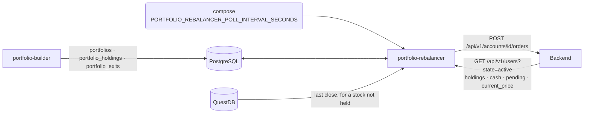
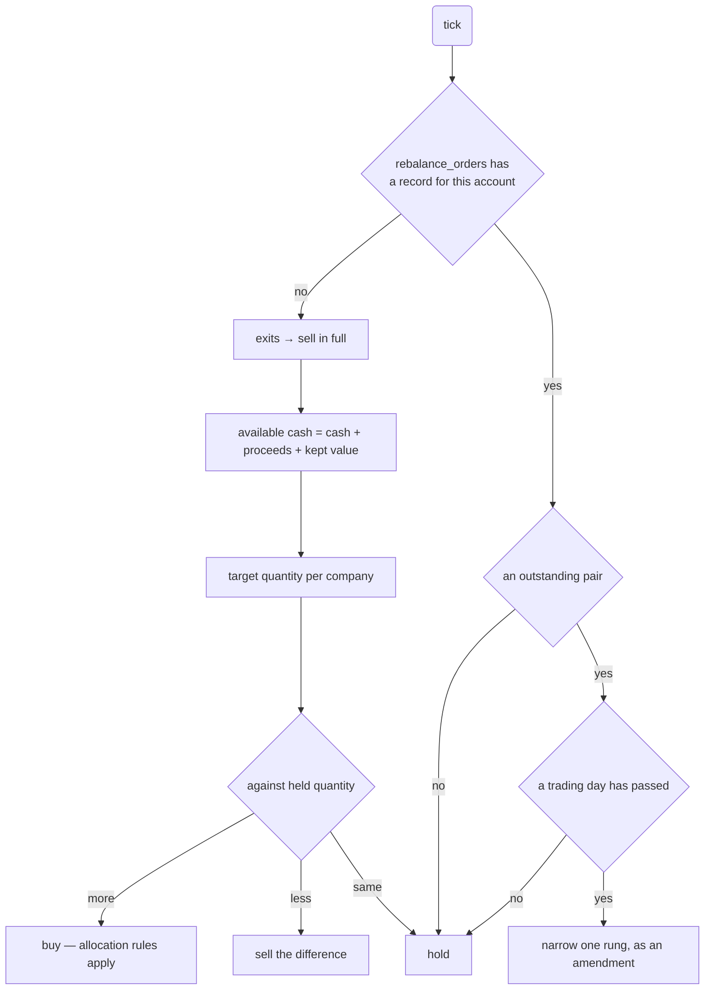

# Portfolio Rebalancer Design

Supersedes `2026-09-28-portfolio-rebalancer-design.md`. That document is left as the record of
what was decided on the 28th; this one records what implementing it and measuring against the
real datastores and the real Backend changed. Everything not listed under **What Changed** is
carried over unaltered, and the sections below restate the design in full so this file can be
read on its own.

## What Changed

| | 28th | 29th | why |
|---|---|---|---|
| Shape | HTTP server `portfolio-rebalancer-http`, `POST /rebalance` | scheduled one-shot `portfolio-rebalancer`, no inbound surface | nothing calls it, and the ladder had no trigger |
| Order endpoint | `account_id` in the body | `POST /api/v1/accounts/{account_id}/orders` | the Backend places orders per account |
| Auth | a token, issuance unsettled | a JWT this service signs, HS256 over a shared secret | the Backend shares `JWT_SECRET`, so we sign |
| Tick rounding | the Backend rounds prices | **we** round to a KRX tick | the Backend answers 400, it does not round |
| Transaction | one per tick | the order is committed before it is sent | a failed send was rolling the record back |
| Migration | `0006` after `#42`'s `0005` | `0007` after `#69`'s `0006` | `#42` was replaced by `#54`'s `0005`, and `#69` took `0006` |
| `rebalance()` | `(portfolio, previous, account, prices)` | `(portfolio, account, prices, days_left)` | exits belong to the portfolio; the band comes from the deadline |
| Ladder budget | three days each for selling and buying | **three trading days for both together** | a buy funded by a sell cannot start its own three days |
| Band | from days elapsed | from days **left** | an order that starts late starts narrow rather than restarting |
| Order shape | two limits, one either side | **one limit plus a trigger we watch** | a limit on the near side fills instantly |
| Trigger | narrowed with the limit | **fixed at 5%** | tightening it strikes a move the limit would wait out |
| Prices | QuestDB `bars` only | **the poll's `current_price`, with QuestDB for a stock not held** | the poll quotes only holdings, and a first purchase has none |
| `stocks[]` key | `stock_id`, converted at the parser | `stock_code` | the poll spells it that way now |
| Last-session cutoff | 14:30 | **15:00** | polling is hourly from 09:00, so that is the last pass |
| Trading days | weekdays | `exchange-calendars` XKRX | 한글날 is not a weekend |
| Budget | three days, fixed | the week's remaining sessions | the next judgement is the deadline |
| Market rung | the morning after | 15:00 on the last session | KRX closes at 15:30 |
| Buys | sized against the sells' expected proceeds | sized against **cash that exists** | the proceeds are not money until the sells fill |

## Purpose

A model portfolio is relative weights. A user has an amount of money and can only buy whole
shares. `portfolio-rebalancer` reconciles the three and emits the buy and sell requests that
move an account toward the portfolio.

The problem that defines the service: capital 10,000,000 with SK하이닉스 at 5% gives a budget
of 500,000, and one share costs 1,800,000. The weight says buy it; the price says it cannot be
bought at all.

## Scope

The service will:

- read the current model portfolio from PostgreSQL;
- rebalance every AI-managed, active account separately, using only that account's own cash, holdings and pending orders;
- poll the Backend hourly for active users, their holdings, cash and pending orders;
- take every price from the Backend's own poll;
- decide which companies can be bought and at what whole-share quantity;
- **round every price it sends to a valid KRX tick**;
- emit buy and sell requests to the Backend with the reason behind each;
- record what it ordered so a restart does not order twice.

The service will not choose which companies belong in the portfolio, place orders at the
exchange, or account for fees, taxes and slippage.

Rounding prices to exchange ticks was on this list as something the service would *not* do. It
now does: the Backend rejects an off-tick price with a 400 rather than rounding it.

## Position in the System

**The service has no inbound surface.** It is invoked on a schedule, does one pass, and exits —
the shape `market-collector` uses, with compose owning the interval.



Every input is a datastore read or an outbound call, and every output is a write or an outbound
call. FastAPI only ever served inbound requests, and the only route was `GET /health`.

**The route design left the ladder with no trigger.** A band narrows once per trading day, but
`POST /rebalance` would be called by portfolio-builder, which runs on the weekly judgement.
Days two and three and the market rung would never fire. Only a scheduled pass can notice that a
pair is still outstanding, which is what reading the day back out of the pair is for.

Idempotency did not depend on the route either: "do not act twice on the same portfolio and
account" is the same `rebalance_orders` lookup whether a route or a tick asks it.

So `AGENTS.md`'s HTTP-edge sentence loses the rebalancer edge. Prices still come from QuestDB
directly for what the poll cannot quote.

## Account State

`GET /api/v1/users?state=active` is polled once an hour, carrying a JWT. Each active user carries
one or more accounts, and every account is decided on its own:

| field | use |
|---|---|
| `account_id` | identifies the account an order is placed against; one user has several |
| `is_ai_managed` | only an AI-managed account is rebalanced |
| `is_active` | an inactive account is skipped |
| `cash_balance` | cash before pending commitments |
| `stocks[]` — `stock_code`, `amount`, `total_price`, `current_price` | quantity held, the principal put into it, and what the Backend quotes it at now |
| `pending_orders[]` | orders placed and not yet filled |

Pending orders are subtracted before anything is decided:

```
available cash = cash_balance − Σ(pending buys: price × amount)
held quantity  = stocks[].amount + Σ(pending buys) − Σ(pending sells)
```

A pending sell adds no cash, because the proceeds do not exist until it fills. A holding's
`total_price` is principal, not a current value; `current_price` is what the position is worth.

The poll is written to PostgreSQL as **the latest state, not a history**, replaced each time.
Five tables, and only `rebalance_orders` accumulates:

| table | from the payload | contents |
|---|---|---|
| `users` | `user_id`, `nickname`, `state` | one row per user |
| `accounts` | `account_id`, `account_name`, `is_ai_managed`, `is_duel_account`, `is_active`, `cash_balance` | one row per account |
| `account_holdings` | `stocks[]` | what the account holds, per account |
| `account_pending_orders` | `pending_orders[]` | orders still outstanding, per account |
| `rebalance_orders` | — | **history** — every order this service sent, and why |

Two columns are renamed: `amount` becomes `quantity` and `total_price` becomes `principal`.
`stock_code` comes through as it is — the poll spells it that way on holdings as well as on
pending orders, so nothing has to be converted.

**Both quantities are stored as decimals.** The poll types a holding's `amount` as an integer
and a pending order's as `123.44`. A mirror that rounds is no longer a mirror of the Backend, so
the rounding to whole shares happens where orders are decided.

**`rebalance_orders.reason` is nullable**, matching `portfolio_holdings.reason` upstream. `NOT
NULL` fails on real data from portfolio-builder.

**A user has several accounts, and each has its own holdings and pending orders.** The example
payload spells `accounts` as an object; the Backend sends a list. Both shapes are accepted, since
which one arrives is unconfirmed.

## Prices

Prices come from two places, and which one is used is decided by what the poll can answer.

**`stocks[].current_price` is the live quote**, and it is what the Backend is trading on, so it
is the number to decide against for anything the account holds — including the trigger.

**QuestDB's last close covers what the poll cannot.** The poll quotes holdings, so a stock being
bought for the first time has no entry in it, and that is precisely when a reference is needed.

The precedence is enforced by omission rather than by a merge: QuestDB is asked only for the
codes the poll did not quote, so the two never carry the same code. A stock neither can price is
skipped with a note and its weight shared out, the same handling a name too dear to buy gets.

## Allocation

`cash_weight` comes from the model portfolio and does two jobs. It is held back before any
budget is computed, so the money available for stocks is `capital × (1 − cash_weight)`, and
whatever the residual pass cannot spend is added back to it.

Capital is the account's cash, plus the proceeds of the exits, plus the market value of the
names being kept. So a name already held at half its target is bought only up to the target
rather than bought again.

The model portfolio has no ranking and no reserve list. A company whose budget cannot cover one
share is dropped and **its weight is shared equally over the companies that remain** — equal,
not in proportion, so one expensive name is not absorbed by whichever holding happened to be
largest. If nothing can be bought, the whole amount is cash.

```
investable = capital × (1 − cash_weight)

loop:
    budget_i = investable × weight_i / Σ weights
    if every company can afford one share: break
    drop the companies that cannot
    share their weight equally over those that remain
```

An equal share of freed weight raises every remaining budget, so a company that was affordable
stays affordable. The set only shrinks, so the loop ends.

**A dropped name that is held is locked out of the capital.** Its value cannot be spent while it
is not being sold, so counting it would size the other buys against money the account cannot
reach. Locking it lowers the capital and the targets are computed again; the locked set only
grows, so this ends too.

### The Residual Pass

Flooring each budget to whole shares leaves cash worth spending. Measured over ten weights on
10,000,000, flooring alone leaves 8–13% idle, which is a different portfolio from the one
portfolio-builder decided on.

The residual is spent one share at a time, in two phases: first for whichever company is
furthest below its ideal amount, and once none is below it, the companies in descending weight
order. Dividing the residual equally instead leaves most of it unspent, because a tenth of it
rarely covers a share. Phase two is reached in about a third of random portfolios, so it is not
dead code.

## Order Ladder

An order is not sent at market first. **A limit order fills as soon as the market reaches it**,
so only the far side can be left sitting: a sell above the market waits for a rise, a buy below
it waits for a dip. The near side cannot be an order at all — a sell below the market fills
instantly at the market price, which is the opposite of waiting.

So each order is **one limit at the far side, and a trigger at the near side this service
watches**. Crossing the trigger replaces the limit with a market order.

```
reference 78,000
  sessions left   sell limit   buy limit   trigger (fixed)
  3               81,900       74,100      -5% / +5%  =  74,100 / 81,900
  2               80,300       75,700      74,100 / 81,900
  1               78,800       77,200      74,100 / 81,900
```

**Only the limit narrows. The trigger stays at 5%.** The point at which waiting stops being
worth it does not move closer just because fewer days remain — tightening it would send an order
at market on a move the limit was still willing to wait out.

A sell that has fallen to its trigger has lost the chance to sell high, so getting out at market
beats holding the order. A buy that has risen to its trigger is not getting its dip.

**Selling and buying share one three-day budget.** The band comes from the trading days that
remain, not from the days an order has been alive, so a buy placed after two days of selling
starts on the 1% band and goes to market with everyone else rather than starting a fresh ladder.
Two days spent selling leaves one for buying.

| days left | band | 78,000 reference |
|---|---|---|
| 3 | reference ± 5% | 74,100 / 81,900 |
| 2 | reference ± 3% | 75,700 / 80,300 |
| 1 | reference ± 1% | 77,200 / 78,800 |
| 0 | **market** | — |

The deadline is read out of the record, not stored: the earliest `created_at` for this
portfolio and account is when the cycle began. Weekends consume none of it.

The market rung is what guarantees the fill; narrowing does not. A ± 1% band is *harder* to
reach than ± 5%, so a price that has walked away from the reference is less likely to come back
inside the narrow band than the wide one.

The reference is fixed when the first pair is placed and every later step is measured from that
same number, not from whatever the close has become since.

**Trading days come from `exchange-calendars`' XKRX**, so public holidays are real rather than
approximated. A Chuseok week really is three sessions, and 한글날 on a Friday really does end
the week on the Thursday.

**The budget is the sessions left in the week the cycle began**, not a fixed three, because the
next judgement lands the week after and an order still working then would be acting on a
portfolio that has been replaced. Five sessions means two days of selling leaves three for
buying; a short week leaves less. With more sessions than bands the widest band simply holds
until the narrowing has somewhere to go.

**The last session ends at 15:00, not at midnight.** Polling starts at 09:00 on the hour and
KRX closes at 15:30, so 15:00 is the last pass before the close and the final band's order goes
at market there rather than the morning after.

### Prices Are Quoted on a KRX Tick

The Backend answers **400** for a price that is not on a tick. It does not round, so this service
does:

| price | tick |
|---|---|
| under 2,000 | 1 |
| 2,000 – under 5,000 | 5 |
| 5,000 – under 20,000 | 10 |
| 20,000 – under 50,000 | 50 |
| 50,000 – under 200,000 | 100 |
| 200,000 – under 500,000 | 500 |
| 500,000 and over | 1,000 |

**Rounding is to the nearest tick, and that is load-bearing rather than a preference.** Flooring
breaks the day recovery below, because the pair stops being symmetric about its reference and
the ratio no longer matches its band.

The reference travels in the payload too, so it is quoted on a tick as well. A market order
carries no price.

### What Is Outstanding

**One order per stock and side.** More than one is a state this service did not create, so it is
left alone rather than guessing which is ours. Nothing is double counted when pending orders are
folded into cash and holdings, because the near side was never an order.

**The trigger is compared with `stocks[].current_price`**, the Backend's own quote, since an
order can only be outstanding on something the account holds or is on its way to holding. A
missing quote is not read as zero: that would fire every sell trigger at once.

**The reference comes from the record, not from the prices.** One limit price cannot say what it
was a band away from, so `rebalance_orders.reference_price` keeps it and
`rebalance_orders.trigger_price` keeps the price to watch. The band still comes from the deadline
rather than being stored. Neither is narrowed, because a rung
placed against a position that has moved is worse than leaving it. A pair carries the **smaller**
of the two outstanding quantities, which is what a partial fill left to buy.

## Rebalance Flow

The initial purchase needs only capital and the model portfolio. A later rebalance works from
what portfolio-builder has already decided — holdings to keep and exits to sell — and **sells
before it buys**, because the proceeds of the sells are part of the cash the buys spend.



**Buys are limited to cash that exists.** The targets are computed against the whole portfolio
including what the exits are worth, but their proceeds are not money until the sells fill. So
the first pass with no cash places only the sells; a pass that finds the sells part filled buys
what that cash covers, largest weight first, costed at the high side because that is the side
that would be paid. A sell that only fills at the deadline leaves the buy no days, and the buy
goes straight to market.

**An order already on the market keeps the quantity it was placed with.** Only its band moves.
Re-deriving its quantity every pass would size it against cash the order itself has committed,
and the quantity would wobble between passes instead of settling.

The allocation rules apply to the buy side only. A sell is always possible, so a target weight
that cannot be reached by buying does not block the sells that fund it. A name too dear to buy,
or one the poll does not quote, is **skipped** with a note rather than sold: being unaffordable
is a buy-side outcome and the model portfolio still names it. A held name in neither the
portfolio nor the exits is left alone, because no reason exists to act on it and every order
carries one.

## Interface

There is no HTTP interface. The service is one command, run on a schedule.

Outbound, all three carrying the `access_token` cookie, and the `POST` the CSRF header
as well:

```
GET  /api/v1/auth/csrf                      (public; the CSRF handshake)
GET  /api/v1/users?state=active
POST /api/v1/accounts/{account_id}/orders
```

**The account is part of the order path, not only the body.** `send_orders` takes the account
from the orders rather than the caller, so one account's orders cannot be posted to another
account's endpoint, and a batch spanning two accounts is refused: a path can only name one. Both
call sites already pass a single account's orders.

An order carries what to do and why — the reason portfolio-builder stored on that holding
(`portfolio_holdings.reason`) or on the exit (`portfolio_exits.reason`). `stock_code` travels
with `company_id` because `company_id` is DART's `corp_code`, which no exchange accepts as an
order identifier; the stock code is joined in from `corporations` (#69 renamed `companies` and
re-keyed it by `stock_code`, keeping `corp_code` unique).

```json
{
  "orders": [
    {"company_id": "00126380", "stock_code": "005930", "action": "buy", "shares": 10,
     "reference": 78000, "band": 0.05, "low": 74100, "high": 81900,
     "weight": 0.08, "reason": "...", "account_id": 11},
    {"company_id": "00164779", "stock_code": "000660", "action": "skip", "shares": 0,
     "weight": 0.05, "account_id": 11,
     "note": "one share costs more than the budget; its weight was shared out equally"}
  ]
}
```

### The JWT

The Backend shares a `JWT_SECRET`, so this service **signs its own token** rather than being
handed one: HS256, with a five-minute life because a tick lives for seconds. The secret is a
`SecretStr`, kept out of logs and repr.

**The claim set was guessed, and is now read from the Backend's own source.** The earlier
version sent `sub`, `iat` and `exp` on an `Authorization: Bearer` header, and every call came
back 401 with no way to tell a rejected token from a missing route. `SecurityConfig` and
`JwtConfig` say why:

| what | the Backend |
|---|---|
| where the token is read | a cookie named `access_token`. Its `BearerTokenResolver` replaces the default one and never reads the `Authorization` header |
| `iss` | required, and compared against the Backend's own issuer (`JwtValidators.createDefaultWithIssuer`) |
| `type` | must be `access`; `refresh` is a different decoder bean |
| `actor` | must be `AI`, or `OrderController` answers 403 `AI_ORDER_ONLY` |
| `sub` | read with `Long.parseLong`, so it is a **user id**, not a service name |

So `PORTFOLIO_REBALANCER_BACKEND_JWT_ISSUER` joins the secret as required configuration, and
`access_token()` carries `iss`, `sub`, `type`, `actor`, `iat` and `exp`.

### CSRF

The Backend keeps CSRF on for state-changing requests with a `CookieCsrfTokenRepository`, so a
`POST` without it is 403 `INVALID_CSRF_TOKEN`. The cookie is `httpOnly`, which is why
`GET /api/v1/auth/csrf` exists and is public: it answers with the token **and** the name of the
header to put it in. `authenticate()` calls it once per run and leaves both credentials on the
`httpx.Client` — the access token as a cookie, the CSRF token as that header — so no call site
has to remember either. The repository compares the header against the cookie it set, so the two
travel together or not at all.

## Failure Handling

**A stale price can misjudge affordability.** The poll runs hourly and QuestDB holds a close, so
either can be out of date. Affordability is a threshold, so a stale 1,750,000 against a budget of 1,800,000 says
"buyable" when the real price has moved to 1,850,000 and it is not. The cheap mitigation is to
require `budget ≥ price × (1 + margin)`, which `whole_shares` already takes.

**An order is committed before it is sent, in its own transaction.** Holding one transaction
across the send undoes the point of recording first. Demonstrated against a real PostgreSQL with
a Backend that took the request and then answered 404: the Backend held the order and
`rebalance_orders` held nothing — the silent order this section exists to prevent.

That leaves a third state, recorded but never stamped as sent, and **the poll answers it.** Every
placeable order goes out in one request, so a single outstanding pair means the request arrived
and only the reply was lost: stamp them. No pair at all means the Backend never took them, so
the record is discarded and the next pass decides again at current prices — better than replaying
a decision made at yesterday's. Nothing that reached the Backend is ever dropped.

A discarded record therefore gets a **new** reference, share count and band. A placed order keeps
the reference its first pair fixed; a record with no pair has no first pair to keep.

**Duplicate orders need less guarding than they appear to.** The poll returns only orders that
are still pending, so a filled order leaves `pending_orders` and appears in `stocks[]`. The next
poll computes the target against the new holdings, finds no gap, and places nothing. The unique
constraint on `(portfolio_id, account_id, stock_code)` is what makes a repeat a no-op, and it is
also why a narrowing is an **amendment in place** rather than a second row.

## Deferred

**An outstanding pair when the next weekly judgement lands.** Three daily steps need three
trading days, so the ladder finishes inside any week with three or more of them:

| holidays | trading days | finishes |
|---|---|---|
| 0 | 5 | Wednesday |
| 1 | 4 | Thursday |
| 2 | 3 | Friday |
| 3 or more | 2 or fewer | runs into the next week |

Only a week cut to two trading days overflows, which in practice means a Seollal or Chuseok
week. **The intended behaviour is to cancel the outstanding pair** and let the new portfolio's
order replace it. It is not implemented in this version, because the case is rare enough that
the handling can wait.

**The work queue.** `#54` records that this service consumes it after the MVP. Not implemented.

**A holiday calendar.** Weekdays stand in for trading days, as above.

## Code Structure

Grouped by domain, the way `news-graph-builder` and `portfolio-builder` are: each package has a
`dto.py`, a `repository.py` for its PostgreSQL queries, and the modules that decide. Outside
clients sit at the top level, as `llm.py` and `market.py` do in those services.

| module | kind | responsibility |
|---|---|---|
| `portfolio/dto.py` | data | the model portfolio as read |
| `portfolio/repository.py` | I/O | the newest model portfolio, joined to `corporations` for stock codes |
| `account/dto.py` | data | what an account can spend and what it holds |
| `account/service.py` | pure | fold pending orders into cash and holdings; the managed accounts |
| `account/repository.py` | I/O | the account mirror of the Backend poll |
| `order/dto.py` | data | the order as sent, a working order, a sized position |
| `order/shares.py` | pure | weights and prices to whole shares, and spending the residual |
| `order/reservations.py` | pure | the pair's prices, the KRX tick, reading a pair back, finding pairs |
| `order/rebalance.py` | pure | what an account with nothing outstanding should hold |
| `order/outstanding.py` | pure | an order already at the Backend: did it arrive, should it narrow |
| `order/repository.py` | I/O | the order history in `rebalance_orders` |
| `trading_days.py` | pure | which days XKRX opens, and how many a cycle has left |
| `market.py` | I/O | the last close from QuestDB, for a stock the poll does not quote |
| `backend.py` | I/O | the JWT, the account poll, the order send |
| `database.py` | schema | the SQLAlchemy tables, mirroring the migrations |
| `tick.py` | orchestration | calls the above in order, and decides nothing |

The `service.py`, `shares.py`, `reservations.py`, `rebalance.py`, `outstanding.py` and
`trading_days.py` modules have no database, socket or clock, so every decision is tested
without anything running. Repositories and clients hold no decisions.

Two modules were split out of one during implementation: deciding what to hold and advancing an
already-placed order are revised for different reasons, so they are separate files, and the
shapes they share live on their own rather than inside either.

```python
def whole_shares(
    targets: Sequence[Holding],
    prices: Mapping[str, float],
    capital: float,
    cash_weight: float,
    margin: float = 0.0,
) -> tuple[list[Position], float]:
    """Positions to hold, and the cash left un-invested."""


def band_for(days_left: int) -> float | None:
    """The band this many sessions allow, or None once the ladder is spent."""


def limit_and_trigger(
    reference: float, days_left: int, side: str
) -> tuple[float, float] | None:
    """The limit to place and the trigger to watch, on a KRX tick, or None at market."""


def on_tick(price: float) -> float:
    """The price rounded to the nearest KRX tick."""


def trigger_hit(side: str, trigger: float, price: float) -> bool:
    """Whether the market has reached the point where waiting stops being worth it."""


def outstanding_orders(pending_orders) -> dict[tuple[str, str], Outstanding]:
    """The orders still working, keyed by stock code and side."""


def apply_pending(account: Mapping[str, object]) -> AccountState:
    """What the account can actually spend and what it actually holds."""


def rebalance(
    portfolio: Portfolio,
    account: AccountState,
    prices: Mapping[str, float],
    days_left: int = LADDER_DAYS,
) -> list[Order]:
    """Sells first, then as much of the buy side as the cash on hand covers."""


def narrow(
    portfolio, account, working, references, started: date, now: datetime
) -> list[Order]:
    """Re-quote each working order at the band its remaining sessions allow.

    `references` comes from `rebalance_orders.reference_price`: one limit price cannot
    say what it was a band away from. An order already at market is not passed in, since
    the ladder has no rung left for it.
    """


def days_left(started: date, now: datetime) -> int:
    """Sessions from now to the week's deadline, ending at 15:00 on the last one."""


def is_open(day: date) -> bool:
    """Whether XKRX holds a session that day."""


def reached_the_backend(stock_codes, working) -> bool:
    """Whether orders recorded but never stamped as sent actually got there."""


def tick(engine, db, client, *, log: BoundLogger) -> int:
    """One pass: poll, decide, send. Returns the number of orders sent.
```

## Migration

`0007_create_rebalance_tables.py`, `down_revision = "0006"`. It chains after `#54`'s
`0005_create_portfolios.py` and `#69`'s `0006_reshape_reference_tables.py`, both on `dev`.
`rebalance_orders.portfolio_id` references `portfolios.id` from `0005`, and the holdings are
read through `corporations`, which `0006` created by renaming `companies`.

`#54` also makes `service_name` a required keyword of `ktb_core.setup_logging`, which this
service must pass or die on startup. CI runs no type checker, so a test pins the call.

## Verification

Each test pins a property the rules have to hold. Beyond the properties, two things were
measured rather than reasoned about:

- **The pair survives tick rounding.** 2,432,028 combinations, zero day-recovery failures,
  37,847 of them straddling two tick bands.
- **A failed send leaves a record.** Reproduced against a real PostgreSQL, before and after.

Storage is exercised against a real PostgreSQL rather than a fake, because what is being checked
is what the database does — cascades, a unique constraint, and replace-not-append. A fake missed
a foreign key that could not resolve.

The whole ladder runs end to end against a real QuestDB and PostgreSQL with a stubbed Backend:
±5%, then ±3%, then ±1%, then market, then nothing, with the same-day re-run emitting nothing.
